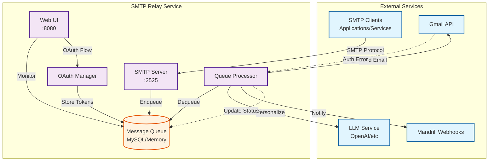

# SMTP Relay Service

A Go-based SMTP relay service that acts as a drop-in replacement for Mandrill, with multi-provider support for Gmail, Mailgun, and optional LLM-powered email personalization.

## Features

- **Multi-Provider Support**: Unified workspace configuration supporting Gmail and Mailgun
- **SMTP Server**: Listens for incoming emails on port 2525
- **MySQL Queue**: Persists messages in MySQL for reliable processing with rate limiting
- **Web UI**: Dashboard to visualize and manage the email queue
- **Google Workspace Integration**: Send emails through Gmail API with service account delegation
- **Mailgun Integration**: Send emails through Mailgun API with tracking and analytics
- **Mandrill Webhooks**: Compatible with Mandrill webhook events
- **LLM Personalization**: Optional AI-powered email personalization using OpenAI, Azure OpenAI, or Groq
- **Domain-Based Routing**: Automatic workspace selection based on sender domain
- **Unified Rate Limiting**: Per-workspace and per-user rate limits across all providers
- **Recipient Tracking**: MySQL-based recipient management with delivery tracking

### Mandrill Webhook Events

The service sends the following Mandrill-compatible webhook events:
- `send` - When an email is successfully sent
- `hard_bounce` - When an email permanently fails
- `deferral` - When an email is temporarily deferred (e.g., OAuth error)
- `reject` - When an email is rejected before sending

Webhook Format:
```json
[{
  "event": "send",
  "_id": "message-uuid",
  "msg": {
    "_id": "message-uuid",
    "state": "sent",
    "email": "recipient@example.com",
    "subject": "Email subject",
    "sender": "sender@example.com"
  },
  "ts": 1634567890
}]
```

## Prerequisites

- Go 1.23 or later
- MySQL 5.7 or later
- Google Workspace with service account (for Gmail)
- Mailgun account (for Mailgun)
- (Optional) OpenAI API key for LLM features

## Quick Start

### 1. Setup and Build

```bash
make setup        # Install dependencies and setup database
make build        # Build the binary
make run          # Run the service
```

### 2. Workspace Configuration

The service uses a unified workspace configuration system. Create `workspace.json`:

```json
[
  {
    "id": "gmail-primary",
    "domain": "yourdomain.com",
    "display_name": "Primary Gmail Workspace",
    "rate_limits": {
      "workspace_daily": 2000,
      "per_user_daily": 100
    },
    "gmail": {
      "service_account_file": "credentials/service-account.json",
      "enabled": true,
      "default_sender": "noreply@yourdomain.com"
    }
  },
  {
    "id": "mailgun-primary",
    "domain": "mail.yourdomain.com",
    "display_name": "Mailgun Workspace",
    "rate_limits": {
      "workspace_daily": 10000,
      "per_user_daily": 500
    },
    "mailgun": {
      "api_key": "your-mailgun-api-key",
      "domain": "mail.yourdomain.com",
      "base_url": "https://api.mailgun.net/v3",
      "region": "us",
      "enabled": true,
      "tracking": {
        "opens": true,
        "clicks": true
      }
    }
  }
]
```

### 3. Environment Configuration

```env
# MySQL Database
MYSQL_HOST=localhost
MYSQL_PORT=3306
MYSQL_USER=root
MYSQL_PASSWORD=your-password
MYSQL_DATABASE=relay

# SMTP Server
SMTP_HOST=0.0.0.0
SMTP_PORT=2525

# Web UI
WEB_UI_PORT=8080

# Optional: LLM Features
LLM_ENABLED=true
OPENAI_API_KEY=your-openai-api-key

# Optional: Production workspace configuration
WORKSPACES_JSON='[{"id":"workspace1",...}]'
```

## Usage

### Workspace Selection

The service automatically routes emails based on the sender domain:
- Emails from `user@yourdomain.com` → Gmail workspace
- Emails from `user@mail.yourdomain.com` → Mailgun workspace

### Sending Emails

Configure your application to send emails to:
- Host: `localhost` (or your server IP)
- Port: `2525`
- No authentication required

### Available Commands

```bash
make build        # Build the binary
make run          # Run in development mode
make test         # Run tests
make lint         # Run linting
make clean        # Clean build artifacts

make docker-build # Build Docker image
make docker-up    # Start with docker-compose
make docker-down  # Stop docker-compose
```

### Web UI

Access the dashboard at: `http://localhost:8080`

Features:
- Real-time queue statistics
- Provider health monitoring
- Message list with filtering
- Workspace configuration display
- Rate limit monitoring

### API Endpoints

**Core APIs:**
- `GET /api/messages` - List messages with filtering
- `GET /api/messages/{id}` - Get message details
- `DELETE /api/messages/{id}` - Delete message
- `GET /api/stats` - Get queue statistics
- `POST /api/process` - Manually trigger processing

**Provider Management:**
- `GET /api/providers` - List all providers and health status
- `GET /api/providers/{id}/info` - Get provider details
- `GET /api/workspaces` - List workspace configurations

**Rate Limiting:**
- `GET /api/rate-limit/{workspace}` - Get workspace rate limit status
- `GET /api/rate-limit/{workspace}/{user}` - Get user rate limit status

### LLM Personalization

When enabled, the service will personalize emails before sending using AI. The personalization:
- Maintains the core message and intent
- Adjusts tone for better engagement
- Uses recipient information from metadata
- Supports OpenAI, Azure OpenAI, and Groq providers

To enable, set:
```env
LLM_ENABLED=true
LLM_PROVIDER=openai  # or azure_openai, groq
OPENAI_API_KEY=your-key
```

You can include recipient metadata in the SMTP message headers:
```
X-Recipient-Name: John Doe
X-Recipient-Company: Acme Corp
```

## Architecture



### Data Flow

1. **Email Reception**: External SMTP clients connect to port 2525 and submit emails
2. **Queue Storage**: Messages are stored in MySQL (or in-memory) queue with metadata
3. **Processing Loop**: Queue processor runs every 30 seconds (configurable) to:
   - Dequeue messages in batches
   - Optionally personalize with LLM
   - Send via Gmail API
   - Call Mandrill webhooks
   - Update message status
4. **OAuth Management**: Web UI handles OAuth flow for Gmail authentication
5. **Monitoring**: Web dashboard provides real-time queue visibility and management

## Docker Support

### Quick Start with Docker Compose

1. **Create environment file**:
```bash
cp .env.example .env
# Edit .env with your settings
```

2. **Add Google credentials**:
```bash
# Place these files in the credentials/ directory:
cp /path/to/credentials.json credentials/
# token.json will be created after first OAuth flow
```

3. **Start services**:
```bash
docker-compose up -d
```

4. **Initialize OAuth** (if not already done):
- Visit http://localhost:8080
- Click on any auth_error message to start OAuth flow

### Docker Commands

```bash
# Build image
docker build -t relay .

# Start all services
docker-compose up -d

# View logs
docker-compose logs -f relay

# Stop services
docker-compose down

# Reset everything (including volumes)
docker-compose down -v

# Development mode with hot reload
docker-compose -f docker-compose.yml -f docker-compose.dev.yml up
```

### Environment Variables

All configuration can be set via environment variables in `.env` or docker-compose.yml:

```env
# Gmail settings
GMAIL_SENDER_EMAIL=your-email@example.com

# MySQL password (optional, defaults provided)
MYSQL_ROOT_PASSWORD=secure-password
MYSQL_PASSWORD=secure-password

# Rate limiting
QUEUE_DAILY_RATE_LIMIT=2000

# LLM settings (optional)
LLM_ENABLED=true
OPENAI_API_KEY=your-key
```

## Development

### Project Structure

```
.
├── cmd/server/         # Main application entry point
├── internal/
│   ├── config/        # Configuration management
│   ├── gmail/         # Google Workspace integration
│   ├── llm/           # LLM personalization
│   ├── queue/         # Queue implementation
│   ├── smtp/          # SMTP server
│   ├── webhook/       # Mandrill webhooks
│   └── webui/         # Web UI server
├── pkg/models/        # Shared data models
├── static/            # Web UI assets
├── schema.sql         # Database schema
└── README.md
```

### Adding New Features

1. Create feature in appropriate `internal/` package
2. Update configuration in `internal/config/`
3. Add database migrations if needed
4. Update Web UI if applicable

## Troubleshooting

### SMTP Connection Issues
- Check firewall allows port 2525
- Verify SMTP_HOST configuration
- Check logs for connection errors

### MySQL Connection Issues
- Verify MySQL is running
- Check credentials in .env
- Ensure database exists

### Gmail Authentication
- Run OAuth flow if token.json missing
- Check credentials.json is valid
- Verify Gmail API is enabled

## License

MIT License - see LICENSE file for details
