# SMTP Relay Service - Architecture Diagrams

## Complete System Architecture

### 1. Multi-Layer Architecture Overview

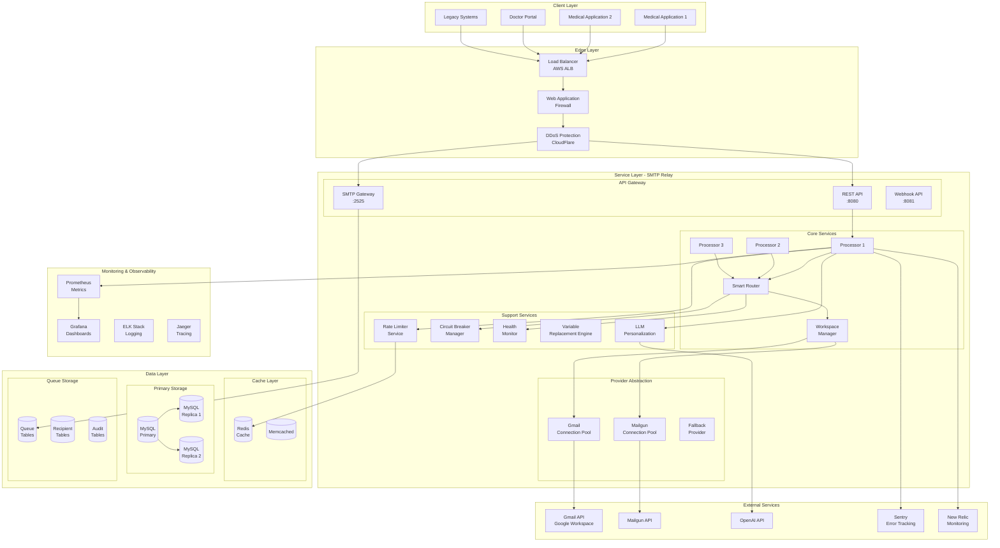

### 2. Message Processing Pipeline

```mermaid
graph LR
    subgraph "1. Ingestion"
        RECEIVE[Receive<br/>SMTP Message]
        PARSE[Parse<br/>Headers & Body]
        VALIDATE[Validate<br/>Format]
        EXTRACT[Extract<br/>Metadata]
    end
    
    subgraph "2. Enrichment"
        WORKSPACE[Identify<br/>Workspace]
        RECIPIENT_TRACK[Track<br/>Recipients]
        VARIABLES[Replace<br/>Variables]
        PERSONALIZE[LLM<br/>Personalization]
    end
    
    subgraph "3. Routing"
        STRATEGY[Apply<br/>Strategy]
        SELECT[Select<br/>Provider]
        FAILOVER[Check<br/>Failover]
        BALANCE[Load<br/>Balance]
    end
    
    subgraph "4. Delivery"
        TRANSFORM[Transform<br/>to Provider Format]
        SEND[Send via<br/>Provider API]
        RETRY[Retry<br/>Logic]
        CONFIRM[Confirm<br/>Delivery]
    end
    
    subgraph "5. Post-Processing"
        UPDATE[Update<br/>Status]
        WEBHOOK[Send<br/>Webhooks]
        METRICS[Update<br/>Metrics]
        CLEANUP[Cleanup<br/>Resources]
    end
    
    RECEIVE --> PARSE
    PARSE --> VALIDATE
    VALIDATE --> EXTRACT
    EXTRACT --> WORKSPACE
    WORKSPACE --> RECIPIENT_TRACK
    RECIPIENT_TRACK --> VARIABLES
    VARIABLES --> PERSONALIZE
    PERSONALIZE --> STRATEGY
    STRATEGY --> SELECT
    SELECT --> FAILOVER
    FAILOVER --> BALANCE
    BALANCE --> TRANSFORM
    TRANSFORM --> SEND
    SEND --> RETRY
    RETRY --> CONFIRM
    CONFIRM --> UPDATE
    UPDATE --> WEBHOOK
    WEBHOOK --> METRICS
    METRICS --> CLEANUP
```

### 3. Provider Selection Algorithm

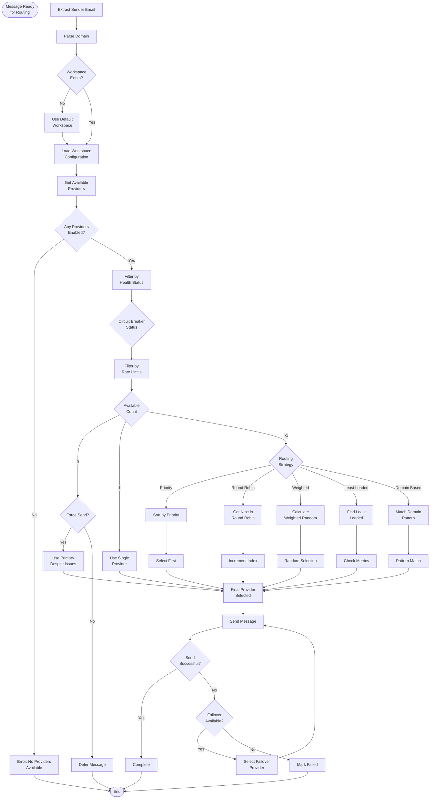

### 4. Rate Limiting Architecture

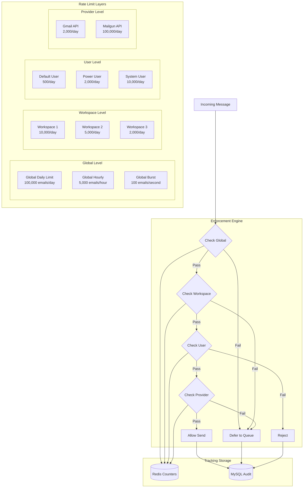

### 5. Circuit Breaker State Machine

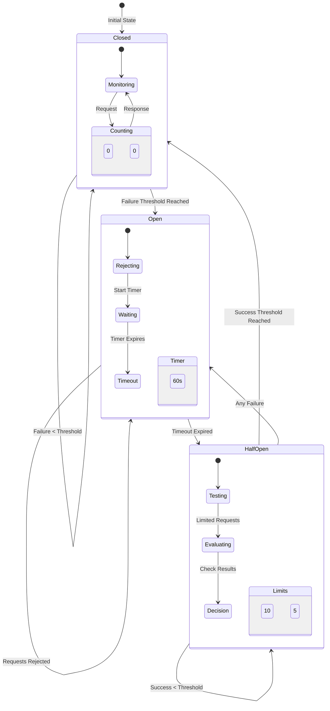

### 6. Database Relationships

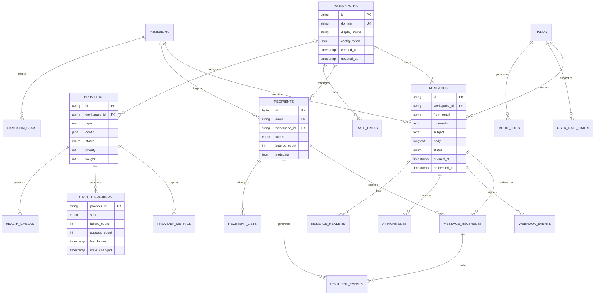

### 7. Deployment Architecture

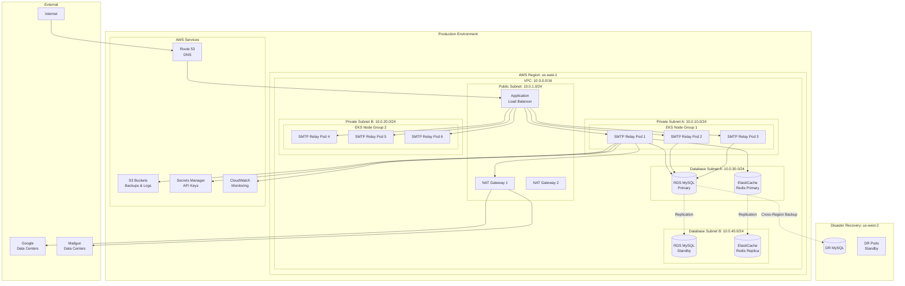

### 8. Security Architecture

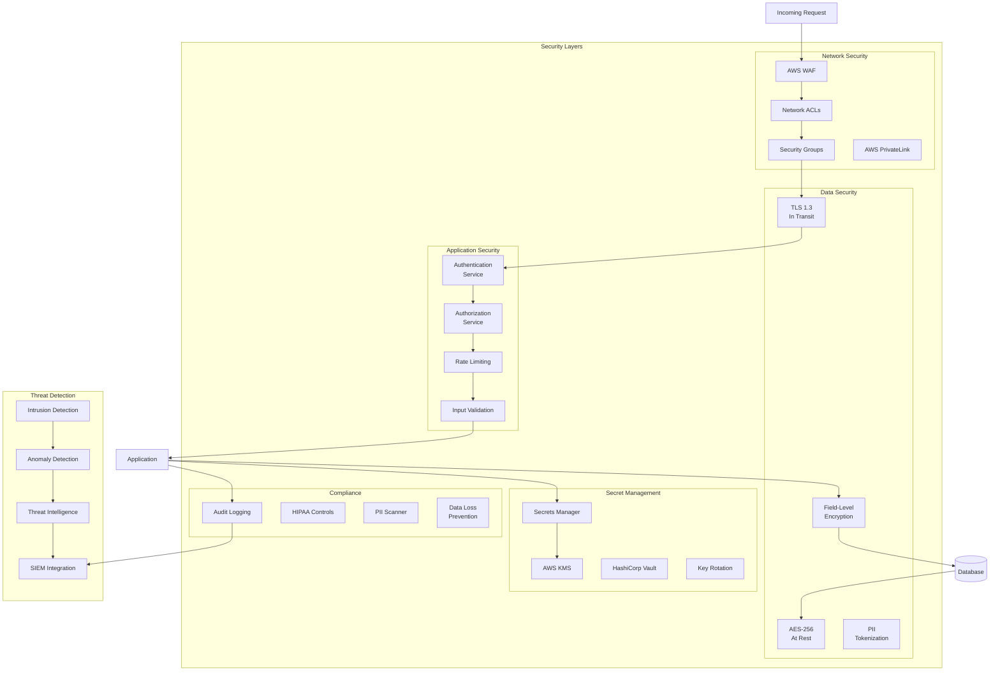

### 9. Monitoring & Observability Stack

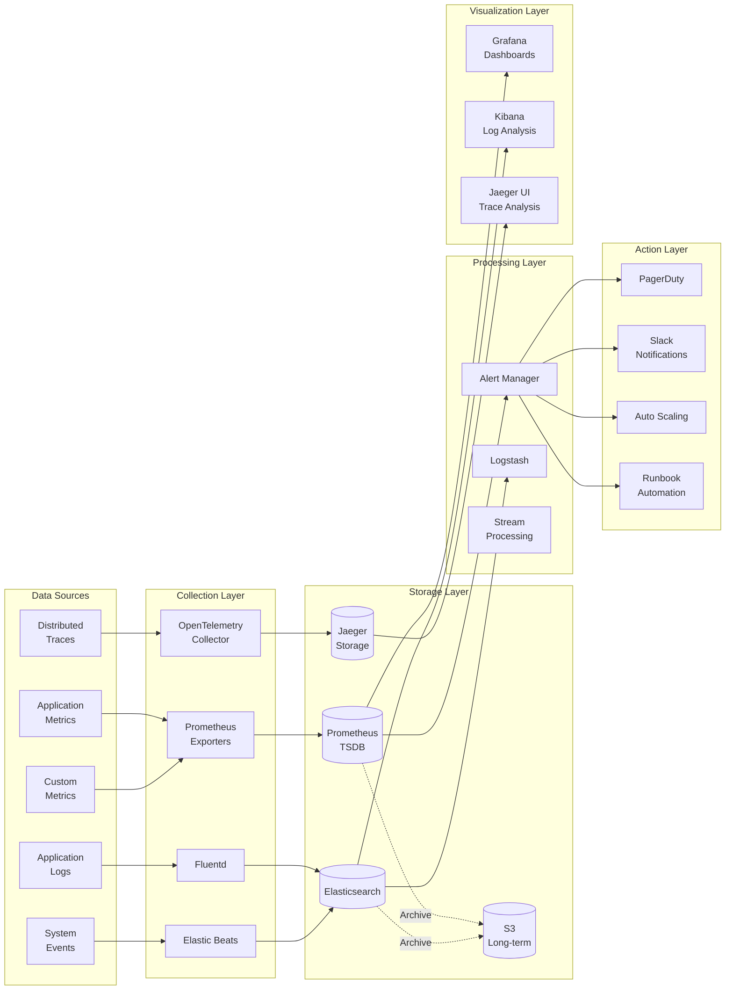

### 10. High Availability & Failover

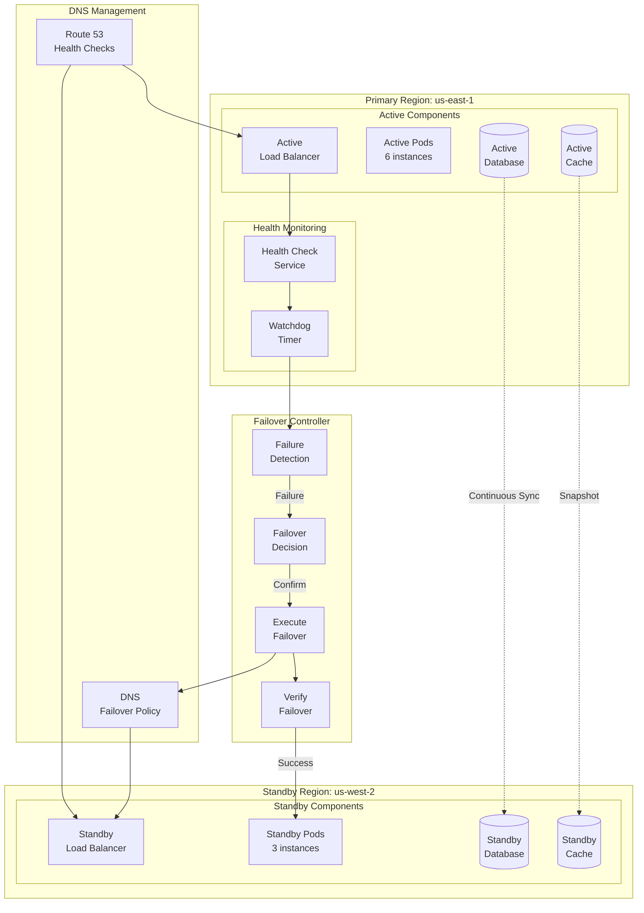

### 11. Data Flow for Email Personalization

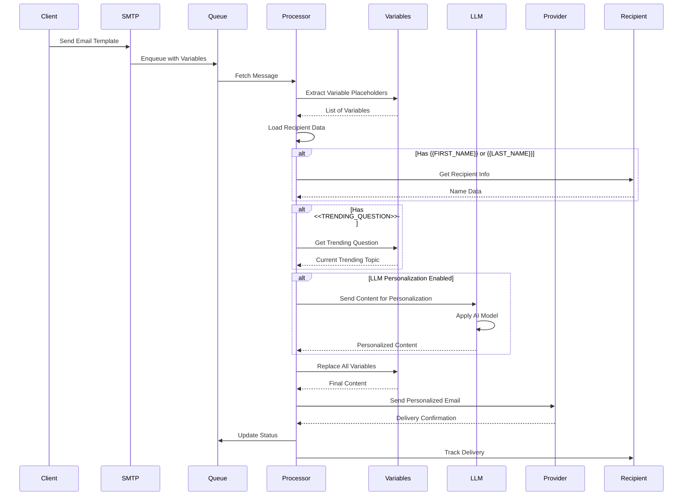

### 12. Workspace Isolation Model

```mermaid
graph TB
    subgraph "Multi-Tenant Architecture"
        subgraph "Workspace: Hospital A"
            WS_A_CONFIG[Configuration]
            WS_A_PROVIDERS[Gmail + Mailgun]
            WS_A_LIMITS[5000 emails/day]
            WS_A_DATA[(Isolated Data)]
            WS_A_USERS[Users: 50]
        end
        
        subgraph "Workspace: Clinic B"
            WS_B_CONFIG[Configuration]
            WS_B_PROVIDERS[Gmail Only]
            WS_B_LIMITS[1000 emails/day]
            WS_B_DATA[(Isolated Data)]
            WS_B_USERS[Users: 10]
        end
        
        subgraph "Workspace: Research Lab C"
            WS_C_CONFIG[Configuration]
            WS_C_PROVIDERS[Mailgun Only]
            WS_C_LIMITS[10000 emails/day]
            WS_C_DATA[(Isolated Data)]
            WS_C_USERS[Users: 100]
        end
    end
    
    subgraph "Shared Infrastructure"
        SHARED_COMPUTE[Compute Resources]
        SHARED_NETWORK[Network Layer]
        SHARED_MONITORING[Monitoring Stack]
    end
    
    subgraph "Isolation Boundaries"
        DATA_ISOLATION[Data Isolation<br/>Row-Level Security]
        CONFIG_ISOLATION[Config Isolation<br/>Workspace Scoped]
        RATE_ISOLATION[Rate Limit Isolation<br/>Per Workspace]
        PROVIDER_ISOLATION[Provider Isolation<br/>Dedicated Credentials]
    end
    
    WS_A_DATA -.->|Isolated| DATA_ISOLATION
    WS_B_DATA -.->|Isolated| DATA_ISOLATION
    WS_C_DATA -.->|Isolated| DATA_ISOLATION
    
    WS_A_CONFIG --> CONFIG_ISOLATION
    WS_B_CONFIG --> CONFIG_ISOLATION
    WS_C_CONFIG --> CONFIG_ISOLATION
    
    WS_A_LIMITS --> RATE_ISOLATION
    WS_B_LIMITS --> RATE_ISOLATION
    WS_C_LIMITS --> RATE_ISOLATION
    
    WS_A_PROVIDERS --> PROVIDER_ISOLATION
    WS_B_PROVIDERS --> PROVIDER_ISOLATION
    WS_C_PROVIDERS --> PROVIDER_ISOLATION
    
    DATA_ISOLATION --> SHARED_COMPUTE
    CONFIG_ISOLATION --> SHARED_COMPUTE
    RATE_ISOLATION --> SHARED_COMPUTE
    PROVIDER_ISOLATION --> SHARED_NETWORK
```

---

## Diagram Legend

### Symbols Used

| Symbol | Meaning |
|--------|---------|
| `[Component]` | Service or Application Component |
| `[(Database)]` | Database or Persistent Storage |
| `{Decision}` | Decision Point in Flow |
| `-->` | Direct Connection/Flow |
| `-.->` | Asynchronous or Optional Connection |
| `subgraph` | Logical Grouping |
| `(Process)` | Start/End Point |

### Color Coding (When Rendered)

- **Blue**: Core Services
- **Green**: Healthy/Active Components
- **Yellow**: Warning/Degraded State
- **Red**: Failed/Inactive Components
- **Gray**: External Services

---

*Document Version: 1.0.0*  
*Last Updated: 2024-01-15*  
*Architecture Diagrams for SMTP Relay Service*