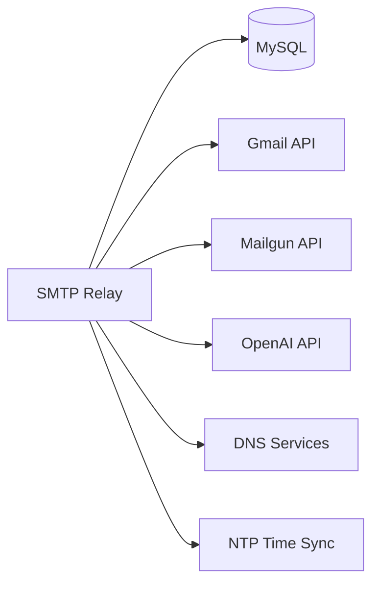

# SMTP Relay Service - Operational Runbook

## Table of Contents

1. [Service Overview](#1-service-overview)
2. [Deployment Procedures](#2-deployment-procedures)
3. [Monitoring & Alerting](#3-monitoring--alerting)
4. [Troubleshooting Procedures](#4-troubleshooting-procedures)
5. [Emergency Procedures](#5-emergency-procedures)
6. [Maintenance Operations](#6-maintenance-operations)
7. [Performance Optimization](#7-performance-optimization)
8. [Backup & Recovery](#8-backup--recovery)

---

## 1. Service Overview

### 1.1 Service Description

The SMTP Relay Service is a critical medical infrastructure component that handles email delivery for Mednet's healthcare applications. It provides reliable, HIPAA-compliant email delivery with multi-provider support and intelligent routing.

### 1.2 Critical Service Metrics

| Metric | Target SLA | Critical Threshold | Page Alert |
|--------|------------|-------------------|------------|
| Availability | 99.95% | < 99.5% | Yes |
| Email Delivery Rate | > 98% | < 95% | Yes |
| Processing Latency (P95) | < 500ms | > 1000ms | Yes |
| Queue Depth | < 1000 | > 5000 | Yes |
| Error Rate | < 1% | > 5% | Yes |
| Provider Health | 100% | < 50% | Yes |

### 1.3 Service Dependencies



---

## 2. Deployment Procedures

### 2.1 Pre-Deployment Checklist

```bash
#!/bin/bash
# pre_deployment_check.sh

echo "=== Pre-Deployment Checklist ==="

# 1. Check current service health
echo "1. Checking service health..."
curl -f http://localhost:8080/api/stats || exit 1

# 2. Verify database connectivity
echo "2. Verifying database..."
mysql -h $MYSQL_HOST -u $MYSQL_USER -p$MYSQL_PASSWORD -e "SELECT 1" || exit 1

# 3. Check provider authentication
echo "3. Checking providers..."
curl -f http://localhost:8080/validate || exit 1

# 4. Verify queue is not backed up
echo "4. Checking queue depth..."
QUEUE_DEPTH=$(mysql -h $MYSQL_HOST -u $MYSQL_USER -p$MYSQL_PASSWORD relay -sN -e "SELECT COUNT(*) FROM messages WHERE status='queued'")
if [ $QUEUE_DEPTH -gt 1000 ]; then
    echo "WARNING: Queue depth is $QUEUE_DEPTH. Consider deferring deployment."
    exit 1
fi

# 5. Check disk space
echo "5. Checking disk space..."
DISK_USAGE=$(df -h / | awk 'NR==2 {print $5}' | sed 's/%//')
if [ $DISK_USAGE -gt 80 ]; then
    echo "WARNING: Disk usage is $DISK_USAGE%"
    exit 1
fi

echo "=== Pre-deployment checks PASSED ==="
```

### 2.2 Blue-Green Deployment

```bash
#!/bin/bash
# blue_green_deploy.sh

VERSION=$1
if [ -z "$VERSION" ]; then
    echo "Usage: ./blue_green_deploy.sh <version>"
    exit 1
fi

echo "=== Starting Blue-Green Deployment for version $VERSION ==="

# Step 1: Deploy to green environment
echo "1. Deploying to green environment..."
kubectl set image deployment/smtp-relay-green smtp-relay=mednet/smtp-relay:$VERSION -n production

# Step 2: Wait for green to be ready
echo "2. Waiting for green deployment..."
kubectl rollout status deployment/smtp-relay-green -n production

# Step 3: Run smoke tests on green
echo "3. Running smoke tests..."
GREEN_IP=$(kubectl get service smtp-relay-green -n production -o jsonpath='{.status.loadBalancer.ingress[0].ip}')
./smoke_tests.sh $GREEN_IP || {
    echo "Smoke tests failed! Rolling back..."
    kubectl rollout undo deployment/smtp-relay-green -n production
    exit 1
}

# Step 4: Switch traffic to green
echo "4. Switching traffic to green..."
kubectl patch service smtp-relay -n production -p '{"spec":{"selector":{"version":"'$VERSION'"}}}'

# Step 5: Monitor for 5 minutes
echo "5. Monitoring new deployment..."
sleep 300

# Step 6: Check error rates
ERROR_RATE=$(curl -s http://localhost:8080/api/stats | jq '.error_rate')
if (( $(echo "$ERROR_RATE > 5" | bc -l) )); then
    echo "High error rate detected! Rolling back..."
    kubectl patch service smtp-relay -n production -p '{"spec":{"selector":{"version":"previous"}}}'
    exit 1
fi

# Step 7: Update blue environment
echo "7. Updating blue environment..."
kubectl set image deployment/smtp-relay-blue smtp-relay=mednet/smtp-relay:$VERSION -n production

echo "=== Deployment completed successfully ==="
```

### 2.3 Rollback Procedure

```bash
#!/bin/bash
# rollback.sh

echo "=== Emergency Rollback Procedure ==="

# Step 1: Confirm rollback
read -p "Are you sure you want to rollback? (yes/no): " confirm
if [ "$confirm" != "yes" ]; then
    echo "Rollback cancelled"
    exit 0
fi

# Step 2: Get previous version
PREVIOUS_VERSION=$(kubectl rollout history deployment/smtp-relay -n production | tail -2 | head -1 | awk '{print $1}')

# Step 3: Initiate rollback
echo "Rolling back to revision $PREVIOUS_VERSION..."
kubectl rollout undo deployment/smtp-relay --to-revision=$PREVIOUS_VERSION -n production

# Step 4: Wait for rollback
kubectl rollout status deployment/smtp-relay -n production

# Step 5: Verify service health
sleep 30
curl -f http://localhost:8080/api/stats || {
    echo "Service health check failed after rollback!"
    exit 1
}

# Step 6: Send notification
./notify_team.sh "Rollback completed to revision $PREVIOUS_VERSION"

echo "=== Rollback completed ==="
```

### 2.4 Canary Deployment

```yaml
# canary-deployment.yaml
apiVersion: flagger.app/v1beta1
kind: Canary
metadata:
  name: smtp-relay
  namespace: production
spec:
  targetRef:
    apiVersion: apps/v1
    kind: Deployment
    name: smtp-relay
  service:
    port: 2525
  analysis:
    interval: 1m
    threshold: 10
    maxWeight: 50
    stepWeight: 10
    metrics:
    - name: request-success-rate
      thresholdRange:
        min: 99
      interval: 1m
    - name: request-duration
      thresholdRange:
        max: 500
      interval: 1m
    webhooks:
    - name: load-test
      url: http://flagger-loadtester.test/
      timeout: 5s
      metadata:
        cmd: "hey -z 1m -q 10 -c 2 http://smtp-relay-canary.production:2525/"
```

---

## 3. Monitoring & Alerting

### 3.1 Key Metrics Dashboard

```yaml
# grafana-dashboard.yaml
apiVersion: v1
kind: ConfigMap
metadata:
  name: smtp-relay-dashboard
data:
  dashboard.json: |
    {
      "dashboard": {
        "title": "SMTP Relay Service",
        "panels": [
          {
            "title": "Email Processing Rate",
            "targets": [
              {
                "expr": "rate(emails_processed_total[5m])"
              }
            ]
          },
          {
            "title": "Queue Depth",
            "targets": [
              {
                "expr": "email_queue_depth"
              }
            ]
          },
          {
            "title": "Provider Success Rate",
            "targets": [
              {
                "expr": "rate(provider_requests_total{status='success'}[5m]) / rate(provider_requests_total[5m])"
              }
            ]
          },
          {
            "title": "Processing Latency",
            "targets": [
              {
                "expr": "histogram_quantile(0.95, email_processing_duration_seconds_bucket)"
              }
            ]
          }
        ]
      }
    }
```

### 3.2 Alert Rules

```yaml
# prometheus-alerts.yaml
groups:
- name: smtp-relay-critical
  interval: 30s
  rules:
  
  - alert: HighQueueDepth
    expr: email_queue_depth > 5000
    for: 5m
    labels:
      severity: critical
      service: smtp-relay
    annotations:
      summary: "High email queue depth"
      description: "Queue depth is {{ $value }} (threshold: 5000)"
      runbook: "https://wiki.mednet.com/runbooks/smtp-relay#high-queue"
  
  - alert: LowDeliveryRate
    expr: rate(emails_delivered_total[5m]) / rate(emails_processed_total[5m]) < 0.95
    for: 10m
    labels:
      severity: critical
      service: smtp-relay
    annotations:
      summary: "Low email delivery rate"
      description: "Delivery rate is {{ $value | humanizePercentage }}"
  
  - alert: AllProvidersDown
    expr: up{job="smtp-providers"} == 0
    for: 1m
    labels:
      severity: critical
      service: smtp-relay
    annotations:
      summary: "All email providers are down"
      description: "No email providers are responding"
  
  - alert: HighErrorRate
    expr: rate(errors_total[5m]) > 0.05
    for: 5m
    labels:
      severity: warning
      service: smtp-relay
    annotations:
      summary: "High error rate detected"
      description: "Error rate is {{ $value | humanizePercentage }}"
  
  - alert: RateLimitExceeded
    expr: rate_limit_remaining < 100
    for: 1m
    labels:
      severity: warning
      service: smtp-relay
    annotations:
      summary: "Approaching rate limit"
      description: "Only {{ $value }} emails remaining in rate limit"
```

### 3.3 Health Check Endpoints

```go
// Health check implementation
package health

import (
    "encoding/json"
    "net/http"
    "time"
)

type HealthStatus struct {
    Status     string            `json:"status"`
    Timestamp  time.Time         `json:"timestamp"`
    Version    string            `json:"version"`
    Checks     map[string]Check  `json:"checks"`
}

type Check struct {
    Status  string `json:"status"`
    Message string `json:"message,omitempty"`
}

func HealthHandler(w http.ResponseWriter, r *http.Request) {
    status := HealthStatus{
        Status:    "healthy",
        Timestamp: time.Now(),
        Version:   VERSION,
        Checks:    make(map[string]Check),
    }
    
    // Check MySQL
    if err := checkMySQL(); err != nil {
        status.Checks["mysql"] = Check{
            Status:  "unhealthy",
            Message: err.Error(),
        }
        status.Status = "degraded"
    } else {
        status.Checks["mysql"] = Check{Status: "healthy"}
    }
    
    // Check Gmail Provider
    if err := checkGmail(); err != nil {
        status.Checks["gmail"] = Check{
            Status:  "unhealthy",
            Message: err.Error(),
        }
        status.Status = "degraded"
    } else {
        status.Checks["gmail"] = Check{Status: "healthy"}
    }
    
    // Check Mailgun Provider
    if err := checkMailgun(); err != nil {
        status.Checks["mailgun"] = Check{
            Status:  "unhealthy",
            Message: err.Error(),
        }
        // Don't degrade overall status if backup provider is down
    } else {
        status.Checks["mailgun"] = Check{Status: "healthy"}
    }
    
    // Check Queue
    queueDepth := getQueueDepth()
    if queueDepth > 5000 {
        status.Checks["queue"] = Check{
            Status:  "warning",
            Message: fmt.Sprintf("Queue depth: %d", queueDepth),
        }
    } else {
        status.Checks["queue"] = Check{Status: "healthy"}
    }
    
    // Set appropriate HTTP status code
    httpStatus := http.StatusOK
    if status.Status == "unhealthy" {
        httpStatus = http.StatusServiceUnavailable
    } else if status.Status == "degraded" {
        httpStatus = http.StatusOK // Still return 200 for degraded
    }
    
    w.Header().Set("Content-Type", "application/json")
    w.WriteHeader(httpStatus)
    json.NewEncoder(w).Encode(status)
}
```

---

## 4. Troubleshooting Procedures

### 4.1 Common Issues Quick Reference

| Symptom | Possible Cause | Quick Fix | Detailed Procedure |
|---------|---------------|-----------|-------------------|
| Emails stuck in queue | Provider down | Check provider health | [4.2](#42-emails-stuck-in-queue) |
| High bounce rate | Invalid recipients | Review recipient list | [4.3](#43-high-bounce-rate) |
| Authentication errors | Expired credentials | Rotate credentials | [4.4](#44-authentication-failures) |
| Slow processing | Database performance | Optimize queries | [4.5](#45-slow-processing) |
| Memory leak | Connection pool | Restart service | [4.6](#46-memory-issues) |
| Rate limit errors | Quota exceeded | Adjust limits | [4.7](#47-rate-limiting-issues) |

### 4.2 Emails Stuck in Queue

```bash
#!/bin/bash
# troubleshoot_queue.sh

echo "=== Troubleshooting Email Queue ==="

# 1. Check queue status
echo "1. Queue Status:"
mysql -h $MYSQL_HOST -u $MYSQL_USER -p$MYSQL_PASSWORD relay -e "
    SELECT status, COUNT(*) as count, MIN(queued_at) as oldest 
    FROM messages 
    GROUP BY status;"

# 2. Check for specific errors
echo "2. Recent Errors:"
mysql -h $MYSQL_HOST -u $MYSQL_USER -p$MYSQL_PASSWORD relay -e "
    SELECT id, from_email, error, retry_count, queued_at 
    FROM messages 
    WHERE status='failed' 
    ORDER BY queued_at DESC 
    LIMIT 10;"

# 3. Check provider health
echo "3. Provider Health:"
curl -s http://localhost:8080/api/providers/health | jq .

# 4. Check rate limits
echo "4. Rate Limit Status:"
curl -s http://localhost:8080/api/rate-limit | jq .

# 5. Force reprocess stuck messages
read -p "Force reprocess stuck messages? (y/n): " reprocess
if [ "$reprocess" = "y" ]; then
    mysql -h $MYSQL_HOST -u $MYSQL_USER -p$MYSQL_PASSWORD relay -e "
        UPDATE messages 
        SET status='queued', retry_count=0 
        WHERE status='processing' 
        AND processed_at < DATE_SUB(NOW(), INTERVAL 30 MINUTE);"
    
    curl -X POST http://localhost:8080/api/process
    echo "Reprocessing initiated"
fi
```

### 4.3 High Bounce Rate

```bash
#!/bin/bash
# investigate_bounces.sh

echo "=== Investigating High Bounce Rate ==="

# 1. Get bounce statistics
echo "1. Bounce Statistics:"
mysql -h $MYSQL_HOST -u $MYSQL_USER -p$MYSQL_PASSWORD relay -e "
    SELECT 
        workspace_id,
        bounce_type,
        COUNT(*) as count,
        COUNT(DISTINCT email_address) as unique_emails
    FROM recipients
    WHERE bounce_count > 0
    AND last_bounce_date > DATE_SUB(NOW(), INTERVAL 24 HOUR)
    GROUP BY workspace_id, bounce_type;"

# 2. Identify problematic domains
echo "2. Problematic Domains:"
mysql -h $MYSQL_HOST -u $MYSQL_USER -p$MYSQL_PASSWORD relay -e "
    SELECT 
        SUBSTRING_INDEX(email_address, '@', -1) as domain,
        COUNT(*) as bounce_count
    FROM recipients
    WHERE status='BOUNCED'
    GROUP BY domain
    ORDER BY bounce_count DESC
    LIMIT 10;"

# 3. Check for specific bounce reasons
echo "3. Bounce Reasons:"
mysql -h $MYSQL_HOST -u $MYSQL_USER -p$MYSQL_PASSWORD relay -e "
    SELECT 
        bounce_reason,
        COUNT(*) as count
    FROM message_recipients
    WHERE delivery_status='BOUNCED'
    AND sent_at > DATE_SUB(NOW(), INTERVAL 24 HOUR)
    GROUP BY bounce_reason
    ORDER BY count DESC
    LIMIT 10;"

# 4. Generate cleanup recommendations
echo "4. Cleanup Recommendations:"
echo "   - Remove hard bounces older than 30 days"
echo "   - Update soft bounces to retry after 24 hours"
echo "   - Validate email addresses before sending"

# 5. Optional: Clean up bounced emails
read -p "Clean up permanently bounced emails? (y/n): " cleanup
if [ "$cleanup" = "y" ]; then
    mysql -h $MYSQL_HOST -u $MYSQL_USER -p$MYSQL_PASSWORD relay -e "
        UPDATE recipients 
        SET status='INACTIVE'
        WHERE bounce_type='HARD'
        AND bounce_count >= 3;"
    echo "Cleanup completed"
fi
```

### 4.4 Authentication Failures

```bash
#!/bin/bash
# fix_auth.sh

echo "=== Fixing Authentication Issues ==="

# 1. Test Gmail authentication
echo "1. Testing Gmail authentication..."
curl -X POST http://localhost:8080/api/test/gmail \
    -H "Content-Type: application/json" \
    -d '{"workspace":"default"}' | jq .

# 2. Test Mailgun authentication
echo "2. Testing Mailgun authentication..."
curl -X POST http://localhost:8080/api/test/mailgun \
    -H "Content-Type: application/json" \
    -d '{"workspace":"default"}' | jq .

# 3. Check credential files
echo "3. Checking credential files..."
for file in credentials/*.json; do
    if [ -f "$file" ]; then
        echo "   Found: $file"
        # Validate JSON structure
        jq empty "$file" 2>/dev/null || echo "   WARNING: Invalid JSON in $file"
    fi
done

# 4. Refresh OAuth tokens
echo "4. Refreshing OAuth tokens..."
./refresh_oauth_tokens.sh

# 5. Rotate API keys if needed
read -p "Rotate API keys? (y/n): " rotate
if [ "$rotate" = "y" ]; then
    echo "Fetching new keys from Secrets Manager..."
    aws secretsmanager get-secret-value --secret-id smtp-relay/api-keys | \
        jq -r '.SecretString' > .env.new
    
    # Backup old configuration
    cp .env .env.backup
    mv .env.new .env
    
    # Restart service to load new keys
    kubectl rollout restart deployment/smtp-relay -n production
    echo "API keys rotated. Service restarting..."
fi
```

### 4.5 Slow Processing

```sql
-- slow_query_analysis.sql

-- 1. Find slow queries
SELECT 
    query_time,
    lock_time,
    rows_sent,
    rows_examined,
    sql_text
FROM mysql.slow_log
WHERE query_time > 1
ORDER BY query_time DESC
LIMIT 10;

-- 2. Analyze message processing bottlenecks
SELECT 
    status,
    COUNT(*) as count,
    AVG(TIMESTAMPDIFF(SECOND, queued_at, processed_at)) as avg_process_time,
    MAX(TIMESTAMPDIFF(SECOND, queued_at, processed_at)) as max_process_time
FROM messages
WHERE processed_at IS NOT NULL
AND queued_at > DATE_SUB(NOW(), INTERVAL 1 HOUR)
GROUP BY status;

-- 3. Check index usage
SELECT 
    table_name,
    index_name,
    cardinality,
    seq_in_index,
    column_name
FROM information_schema.statistics
WHERE table_schema = 'relay'
ORDER BY table_name, index_name, seq_in_index;

-- 4. Identify missing indexes
SELECT 
    tables.table_name,
    tables.table_rows,
    ROUND(data_length/1024/1024, 2) as data_mb,
    ROUND(index_length/1024/1024, 2) as index_mb
FROM information_schema.tables
WHERE table_schema = 'relay'
ORDER BY data_mb DESC;

-- 5. Optimize tables
OPTIMIZE TABLE messages;
OPTIMIZE TABLE recipients;
OPTIMIZE TABLE message_recipients;
```

### 4.6 Memory Issues

```bash
#!/bin/bash
# diagnose_memory.sh

echo "=== Memory Diagnostics ==="

# 1. Check current memory usage
echo "1. Current Memory Usage:"
free -h
echo ""
ps aux | grep relay | head -5

# 2. Check for memory leaks
echo "2. Memory Growth Pattern:"
for i in {1..5}; do
    PID=$(pgrep -f "relay")
    if [ -n "$PID" ]; then
        RSS=$(ps -o rss= -p $PID)
        echo "   Iteration $i: RSS = $RSS KB"
        sleep 10
    fi
done

# 3. Check connection pools
echo "3. Database Connections:"
mysql -h $MYSQL_HOST -u $MYSQL_USER -p$MYSQL_PASSWORD -e "SHOW PROCESSLIST;" | wc -l

# 4. Generate heap dump
read -p "Generate heap dump for analysis? (y/n): " heapdump
if [ "$heapdump" = "y" ]; then
    PID=$(pgrep -f "relay")
    if [ -n "$PID" ]; then
        # For Go applications, use pprof
        curl http://localhost:6060/debug/pprof/heap > heap_$(date +%Y%m%d_%H%M%S).pprof
        echo "Heap dump saved"
    fi
fi

# 5. Restart if necessary
read -p "Restart service to clear memory? (y/n): " restart
if [ "$restart" = "y" ]; then
    kubectl rollout restart deployment/smtp-relay -n production
    echo "Service restart initiated"
fi
```

### 4.7 Rate Limiting Issues

```bash
#!/bin/bash
# manage_rate_limits.sh

echo "=== Rate Limit Management ==="

# 1. Check current usage
echo "1. Current Rate Limit Usage:"
curl -s http://localhost:8080/api/rate-limit | jq .

# 2. Identify high-volume senders
echo "2. Top Senders (last hour):"
mysql -h $MYSQL_HOST -u $MYSQL_USER -p$MYSQL_PASSWORD relay -e "
    SELECT 
        from_email,
        workspace_id,
        COUNT(*) as sent_count
    FROM messages
    WHERE queued_at > DATE_SUB(NOW(), INTERVAL 1 HOUR)
    GROUP BY from_email, workspace_id
    ORDER BY sent_count DESC
    LIMIT 10;"

# 3. Check deferred messages
echo "3. Deferred Messages:"
mysql -h $MYSQL_HOST -u $MYSQL_USER -p$MYSQL_PASSWORD relay -e "
    SELECT 
        workspace_id,
        COUNT(*) as deferred_count
    FROM messages
    WHERE status='queued'
    AND error LIKE '%rate limit%'
    GROUP BY workspace_id;"

# 4. Temporary limit adjustment
read -p "Temporarily increase limits? (y/n): " increase
if [ "$increase" = "y" ]; then
    # Update configuration
    cat > /tmp/rate_limit_override.json <<EOF
{
    "workspace_daily": 10000,
    "per_user_daily": 1000,
    "emergency_mode": true
}
EOF
    
    # Apply override
    curl -X POST http://localhost:8080/api/admin/rate-limit \
        -H "Content-Type: application/json" \
        -d @/tmp/rate_limit_override.json
    
    echo "Temporary rate limit increase applied for 1 hour"
    
    # Schedule revert
    echo "kubectl exec -it deployment/smtp-relay -- curl -X DELETE http://localhost:8080/api/admin/rate-limit" | at now + 1 hour
fi
```

---

## 5. Emergency Procedures

### 5.1 Service Complete Failure

```bash
#!/bin/bash
# emergency_recovery.sh

echo "=== EMERGENCY RECOVERY PROCEDURE ==="
echo "Time: $(date)"

# 1. Immediate failover to backup region
echo "1. Initiating failover to backup region..."
aws route53 change-resource-record-sets \
    --hosted-zone-id Z123456789 \
    --change-batch '{
        "Changes": [{
            "Action": "UPSERT",
            "ResourceRecordSet": {
                "Name": "smtp.mednet.com",
                "Type": "A",
                "AliasTarget": {
                    "HostedZoneId": "Z098765432",
                    "DNSName": "smtp-backup.us-west-2.elb.amazonaws.com",
                    "EvaluateTargetHealth": true
                }
            }
        }]
    }'

# 2. Start emergency message queue processor
echo "2. Starting emergency processor..."
docker run -d \
    --name emergency-processor \
    -e EMERGENCY_MODE=true \
    -e MYSQL_HOST=$BACKUP_MYSQL_HOST \
    -v /emergency/config:/config \
    mednet/smtp-relay:stable \
    /app/emergency-processor

# 3. Send critical notifications
echo "3. Sending notifications..."
./notify_team.sh "CRITICAL: SMTP Relay service failure. Failover initiated."

# 4. Start collecting diagnostics
echo "4. Collecting diagnostics..."
mkdir -p /emergency/diagnostics/$(date +%Y%m%d_%H%M%S)
cd /emergency/diagnostics/$(date +%Y%m%d_%H%M%S)

# Collect logs
kubectl logs deployment/smtp-relay -n production --tail=10000 > app.log
kubectl describe pods -n production > pods.txt
kubectl get events -n production > events.txt

# Database status
mysql -h $MYSQL_HOST -u $MYSQL_USER -p$MYSQL_PASSWORD -e "SHOW STATUS;" > mysql_status.txt

# Network diagnostics
netstat -an > netstat.txt
ss -s > socket_stats.txt

echo "=== Emergency procedures initiated. Awaiting manual intervention. ==="
```

### 5.2 Data Corruption Recovery

```bash
#!/bin/bash
# data_corruption_recovery.sh

echo "=== Data Corruption Recovery ==="

# 1. Stop all processing
echo "1. Stopping all processors..."
kubectl scale deployment/smtp-relay --replicas=0 -n production

# 2. Identify corruption extent
echo "2. Checking data integrity..."
mysql -h $MYSQL_HOST -u $MYSQL_USER -p$MYSQL_PASSWORD relay -e "
    SELECT 
        table_name,
        COUNT(*) as total_rows
    FROM information_schema.tables
    WHERE table_schema = 'relay';"

# 3. Backup current state
echo "3. Creating emergency backup..."
mysqldump -h $MYSQL_HOST -u $MYSQL_USER -p$MYSQL_PASSWORD \
    --single-transaction --quick --lock-tables=false \
    relay > /backup/emergency_$(date +%Y%m%d_%H%M%S).sql

# 4. Restore from last known good backup
echo "4. Restoring from backup..."
LAST_GOOD_BACKUP=$(ls -t /backup/daily_*.sql | head -1)
echo "Using backup: $LAST_GOOD_BACKUP"

mysql -h $MYSQL_HOST -u $MYSQL_USER -p$MYSQL_PASSWORD relay < $LAST_GOOD_BACKUP

# 5. Replay transaction log
echo "5. Replaying transactions..."
mysqlbinlog --start-datetime="2024-01-15 00:00:00" \
    /var/lib/mysql/mysql-bin.* | \
    mysql -h $MYSQL_HOST -u $MYSQL_USER -p$MYSQL_PASSWORD relay

# 6. Verify data integrity
echo "6. Verifying integrity..."
mysql -h $MYSQL_HOST -u $MYSQL_USER -p$MYSQL_PASSWORD relay -e "
    CHECK TABLE messages, recipients, message_recipients;"

# 7. Restart services
echo "7. Restarting services..."
kubectl scale deployment/smtp-relay --replicas=3 -n production

echo "=== Recovery complete. Please verify service operation. ==="
```

### 5.3 Security Breach Response

```bash
#!/bin/bash
# security_breach_response.sh

echo "=== SECURITY BREACH RESPONSE ==="
echo "Initiated at: $(date)"
echo "Initiated by: $USER"

# 1. Isolate affected systems
echo "1. Isolating systems..."
# Block all external traffic except management
iptables -P INPUT DROP
iptables -P OUTPUT DROP
iptables -A INPUT -s 10.0.0.0/8 -j ACCEPT
iptables -A OUTPUT -d 10.0.0.0/8 -j ACCEPT

# 2. Preserve evidence
echo "2. Preserving evidence..."
mkdir -p /forensics/$(date +%Y%m%d_%H%M%S)
cd /forensics/$(date +%Y%m%d_%H%M%S)

# Capture memory
sudo dd if=/dev/mem of=memory.dump bs=1M

# Capture network connections
netstat -an > netstat_connections.txt
ss -tupn > socket_connections.txt

# Capture processes
ps auxww > processes.txt
lsof > open_files.txt

# Capture logs
tar -czf logs.tar.gz /var/log/

# 3. Rotate all credentials
echo "3. Rotating credentials..."
# Rotate database passwords
NEW_DB_PASS=$(openssl rand -hex 32)
mysql -u root -p -e "ALTER USER '$MYSQL_USER'@'%' IDENTIFIED BY '$NEW_DB_PASS';"

# Rotate API keys
aws secretsmanager rotate-secret --secret-id smtp-relay/api-keys

# 4. Audit access logs
echo "4. Auditing access..."
mysql -h $MYSQL_HOST -u $MYSQL_USER -p$MYSQL_PASSWORD relay -e "
    SELECT 
        user_id,
        action,
        ip_address,
        created_at
    FROM audit_log
    WHERE created_at > DATE_SUB(NOW(), INTERVAL 24 HOUR)
    ORDER BY created_at DESC;" > access_audit.txt

# 5. Notify security team
echo "5. Notifying security team..."
./notify_security.sh "CRITICAL: Potential security breach detected in SMTP Relay service"

echo "=== Initial response complete. Awaiting security team investigation. ==="
```

---

## 6. Maintenance Operations

### 6.1 Scheduled Maintenance Procedure

```bash
#!/bin/bash
# scheduled_maintenance.sh

echo "=== Scheduled Maintenance Procedure ==="
echo "Maintenance window: $(date) to $(date -d '+2 hours')"

# 1. Send maintenance notification
echo "1. Sending notifications..."
./notify_users.sh "Scheduled maintenance will begin in 15 minutes"

# 2. Enable maintenance mode
echo "2. Enabling maintenance mode..."
kubectl apply -f - <<EOF
apiVersion: v1
kind: ConfigMap
metadata:
  name: smtp-relay-config
  namespace: production
data:
  maintenance_mode: "true"
  maintenance_message: "Service under maintenance. Expected completion: $(date -d '+2 hours')"
EOF

# 3. Drain traffic gradually
echo "3. Draining traffic..."
for i in {100..0..10}; do
    kubectl patch service smtp-relay -n production \
        -p '{"spec":{"selector":{"traffic":"'$i'"}}}'
    echo "Traffic at $i%"
    sleep 30
done

# 4. Perform maintenance tasks
echo "4. Performing maintenance..."

# Database maintenance
mysql -h $MYSQL_HOST -u $MYSQL_USER -p$MYSQL_PASSWORD relay -e "
    OPTIMIZE TABLE messages;
    OPTIMIZE TABLE recipients;
    ANALYZE TABLE message_recipients;"

# Clean old data
mysql -h $MYSQL_HOST -u $MYSQL_USER -p$MYSQL_PASSWORD relay -e "
    DELETE FROM messages 
    WHERE status IN ('sent', 'failed') 
    AND processed_at < DATE_SUB(NOW(), INTERVAL 90 DAY);"

# Update software
kubectl set image deployment/smtp-relay smtp-relay=mednet/smtp-relay:$NEW_VERSION -n production

# 5. Restore traffic
echo "5. Restoring traffic..."
for i in {0..100..10}; do
    kubectl patch service smtp-relay -n production \
        -p '{"spec":{"selector":{"traffic":"'$i'"}}}'
    echo "Traffic at $i%"
    sleep 30
done

# 6. Disable maintenance mode
echo "6. Disabling maintenance mode..."
kubectl patch configmap smtp-relay-config -n production \
    -p '{"data":{"maintenance_mode":"false"}}'

echo "=== Maintenance complete ==="
```

### 6.2 Database Maintenance

```sql
-- database_maintenance.sql

-- 1. Analyze table statistics
ANALYZE TABLE messages;
ANALYZE TABLE recipients;
ANALYZE TABLE message_recipients;
ANALYZE TABLE webhook_events;

-- 2. Optimize tables
OPTIMIZE TABLE messages;
OPTIMIZE TABLE recipients;
OPTIMIZE TABLE message_recipients;

-- 3. Clean up old data
-- Archive old messages
INSERT INTO messages_archive 
SELECT * FROM messages 
WHERE processed_at < DATE_SUB(NOW(), INTERVAL 90 DAY);

DELETE FROM messages 
WHERE processed_at < DATE_SUB(NOW(), INTERVAL 90 DAY);

-- Clean up orphaned records
DELETE mr FROM message_recipients mr
LEFT JOIN messages m ON mr.message_id = m.id
WHERE m.id IS NULL;

-- 4. Update statistics
SELECT 
    table_name,
    table_rows,
    ROUND(data_length/1024/1024, 2) as data_mb,
    ROUND(index_length/1024/1024, 2) as index_mb,
    ROUND((data_length+index_length)/1024/1024, 2) as total_mb
FROM information_schema.tables
WHERE table_schema = 'relay'
ORDER BY total_mb DESC;

-- 5. Check for fragmentation
SELECT 
    table_name,
    ROUND(data_free/1024/1024, 2) as fragmented_mb
FROM information_schema.tables
WHERE table_schema = 'relay'
AND data_free > 1024*1024
ORDER BY data_free DESC;
```

---

## 7. Performance Optimization

### 7.1 Query Optimization

```sql
-- query_optimization.sql

-- 1. Add missing indexes
ALTER TABLE messages 
ADD INDEX idx_workspace_status_queued (workspace_id, status, queued_at);

ALTER TABLE recipients 
ADD INDEX idx_email_workspace (email_address, workspace_id);

ALTER TABLE message_recipients 
ADD INDEX idx_sent_status (sent_at, delivery_status);

-- 2. Optimize slow queries
-- Original slow query
-- SELECT * FROM messages WHERE status='queued' ORDER BY queued_at;

-- Optimized query
SELECT 
    id, from_email, to_emails, subject, workspace_id
FROM messages 
USE INDEX (idx_status_queued)
WHERE status='queued' 
ORDER BY queued_at 
LIMIT 100;

-- 3. Create summary tables for reporting
CREATE TABLE IF NOT EXISTS daily_stats (
    date DATE PRIMARY KEY,
    workspace_id VARCHAR(255),
    total_sent INT,
    total_failed INT,
    total_bounced INT,
    avg_process_time FLOAT,
    INDEX idx_workspace_date (workspace_id, date)
);

-- Populate summary table
INSERT INTO daily_stats 
SELECT 
    DATE(processed_at) as date,
    workspace_id,
    SUM(CASE WHEN status='sent' THEN 1 ELSE 0 END) as total_sent,
    SUM(CASE WHEN status='failed' THEN 1 ELSE 0 END) as total_failed,
    SUM(CASE WHEN status='bounced' THEN 1 ELSE 0 END) as total_bounced,
    AVG(TIMESTAMPDIFF(SECOND, queued_at, processed_at)) as avg_process_time
FROM messages
WHERE processed_at IS NOT NULL
GROUP BY DATE(processed_at), workspace_id
ON DUPLICATE KEY UPDATE
    total_sent = VALUES(total_sent),
    total_failed = VALUES(total_failed),
    total_bounced = VALUES(total_bounced),
    avg_process_time = VALUES(avg_process_time);
```

### 7.2 Application Tuning

```yaml
# performance-config.yaml
apiVersion: v1
kind: ConfigMap
metadata:
  name: smtp-relay-performance
data:
  # Connection pool settings
  db_max_connections: "50"
  db_max_idle: "20"
  db_conn_lifetime: "300s"
  
  # Processing settings
  batch_size: "50"
  process_interval: "10s"
  worker_count: "10"
  
  # Cache settings
  cache_enabled: "true"
  cache_ttl: "300s"
  cache_size: "1000"
  
  # Rate limiting
  rate_limit_burst: "100"
  rate_limit_refill: "10"
  
  # Timeout settings
  provider_timeout: "30s"
  webhook_timeout: "10s"
  llm_timeout: "20s"
```

---

## 8. Backup & Recovery

### 8.1 Automated Backup Script

```bash
#!/bin/bash
# automated_backup.sh

# Configuration
BACKUP_DIR="/backup/smtp-relay"
S3_BUCKET="s3://mednet-backups/smtp-relay"
RETENTION_DAYS=30
DATE=$(date +%Y%m%d_%H%M%S)

echo "=== Starting Backup: $DATE ==="

# 1. Create backup directory
mkdir -p $BACKUP_DIR/$DATE

# 2. Backup MySQL database
echo "Backing up MySQL..."
mysqldump -h $MYSQL_HOST -u $MYSQL_USER -p$MYSQL_PASSWORD \
    --single-transaction \
    --routines \
    --triggers \
    --events \
    relay > $BACKUP_DIR/$DATE/relay.sql

# Compress backup
gzip $BACKUP_DIR/$DATE/relay.sql

# 3. Backup configuration files
echo "Backing up configuration..."
tar -czf $BACKUP_DIR/$DATE/config.tar.gz \
    .env \
    workspace.json \
    gateway-config.json \
    credentials/

# 4. Backup recent logs
echo "Backing up logs..."
tar -czf $BACKUP_DIR/$DATE/logs.tar.gz \
    --newer-mtime="1 day ago" \
    /var/log/smtp-relay/

# 5. Create backup manifest
cat > $BACKUP_DIR/$DATE/manifest.json <<EOF
{
    "timestamp": "$(date -Iseconds)",
    "version": "$(git rev-parse HEAD)",
    "database_size": "$(du -h $BACKUP_DIR/$DATE/relay.sql.gz | cut -f1)",
    "config_size": "$(du -h $BACKUP_DIR/$DATE/config.tar.gz | cut -f1)",
    "logs_size": "$(du -h $BACKUP_DIR/$DATE/logs.tar.gz | cut -f1)"
}
EOF

# 6. Upload to S3
echo "Uploading to S3..."
aws s3 cp $BACKUP_DIR/$DATE/ $S3_BUCKET/$DATE/ --recursive

# 7. Verify upload
aws s3 ls $S3_BUCKET/$DATE/ --recursive

# 8. Clean up old backups
echo "Cleaning old backups..."
find $BACKUP_DIR -maxdepth 1 -type d -mtime +$RETENTION_DAYS -exec rm -rf {} \;

# 9. Clean S3 old backups
aws s3 ls $S3_BUCKET/ | while read -r line; do
    createDate=$(echo $line | awk '{print $1" "$2}')
    createDate=$(date -d "$createDate" +%s)
    olderThan=$(date -d "$RETENTION_DAYS days ago" +%s)
    if [[ $createDate -lt $olderThan ]]; then
        folder=$(echo $line | awk '{print $4}')
        aws s3 rm $S3_BUCKET/$folder --recursive
    fi
done

echo "=== Backup Complete: $DATE ==="
```

### 8.2 Recovery Testing

```bash
#!/bin/bash
# test_recovery.sh

echo "=== Recovery Test Procedure ==="

# 1. Create test environment
echo "1. Creating test environment..."
docker-compose -f docker-compose.test.yml up -d

# 2. Restore from backup
echo "2. Restoring from latest backup..."
LATEST_BACKUP=$(aws s3 ls $S3_BUCKET/ | tail -1 | awk '{print $4}')
aws s3 cp $S3_BUCKET/$LATEST_BACKUP/ /tmp/recovery_test/ --recursive

# 3. Load database
echo "3. Loading database..."
gunzip < /tmp/recovery_test/relay.sql.gz | \
    mysql -h localhost -P 3307 -u root -ptest relay_test

# 4. Verify data integrity
echo "4. Verifying data..."
RECORD_COUNT=$(mysql -h localhost -P 3307 -u root -ptest relay_test -sN -e "SELECT COUNT(*) FROM messages;")
echo "Recovered $RECORD_COUNT messages"

# 5. Test basic operations
echo "5. Testing operations..."
curl -X POST http://localhost:8081/api/test \
    -H "Content-Type: application/json" \
    -d '{"action":"send_test_email"}'

# 6. Clean up
echo "6. Cleaning up test environment..."
docker-compose -f docker-compose.test.yml down -v

echo "=== Recovery test complete ==="
```

---

## Appendices

### A. Emergency Contact List

| Role | Primary Contact | Backup Contact | Escalation |
|------|----------------|----------------|------------|
| On-Call Engineer | PagerDuty: smtp-relay | Slack: #oncall | 5 min |
| Database Admin | PagerDuty: dba-team | Phone: +1-555-0100 | 10 min |
| Security Team | security@mednet.com | PagerDuty: security | Immediate |
| Provider Support | | | |
| - Gmail | Google Workspace Support | TAM: john@google.com | 1 hour |
| - Mailgun | support@mailgun.com | TAM: jane@mailgun.com | 1 hour |
| Management | CTO: cto@mednet.com | VP Eng: vpe@mednet.com | 30 min |

### B. Service Dependencies

| Service | Criticality | Fallback | Contact |
|---------|-------------|----------|---------|
| MySQL | Critical | None - Service fails | DBA Team |
| Gmail API | High | Mailgun | Google Support |
| Mailgun API | Medium | Gmail | Mailgun Support |
| OpenAI API | Low | Disable personalization | N/A |
| DNS | Critical | Secondary DNS | Network Team |

### C. Runbook Changelog

| Version | Date | Author | Changes |
|---------|------|--------|---------|
| 1.0.0 | 2024-01-15 | Ops Team | Initial version |
| 1.0.1 | 2024-01-20 | J. Smith | Added security breach procedure |
| 1.0.2 | 2024-01-25 | A. Johnson | Updated backup procedures |

---

*Document Version: 1.0.2*  
*Last Updated: 2024-01-25*  
*Next Review: 2024-02-25*  
*Owner: Mednet Operations Team*