# SMTP Relay Service - Technical Documentation

## Table of Contents

1. [System Architecture](#1-system-architecture)
2. [API Documentation](#2-api-documentation)
3. [Operational Runbook](#3-operational-runbook)
4. [Developer Guide](#4-developer-guide)
5. [Security & Compliance](#5-security--compliance)
6. [Configuration Reference](#6-configuration-reference)

---

## 1. System Architecture

### 1.1 High-Level Architecture

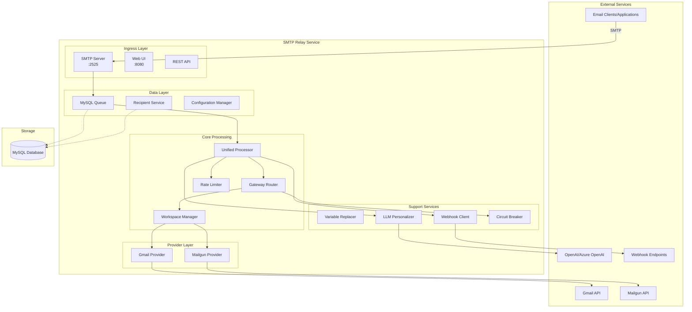

### 1.2 Component Interaction Flow

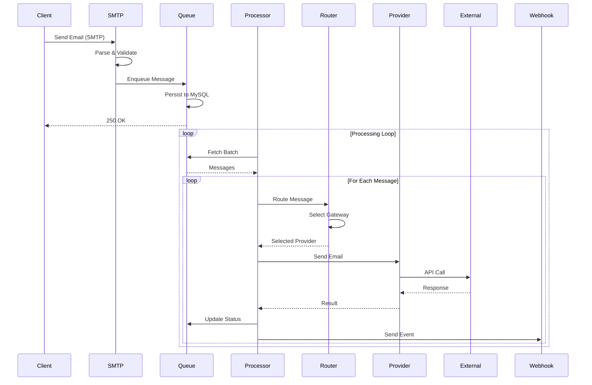

### 1.3 Database Schema

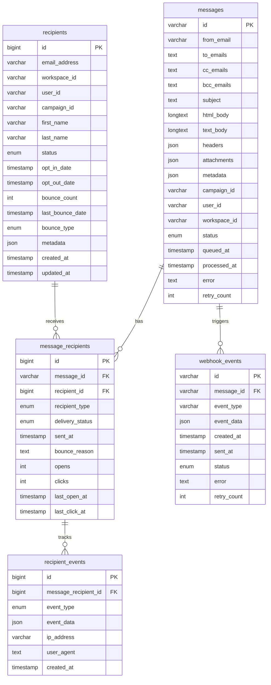

### 1.4 Provider Routing Logic

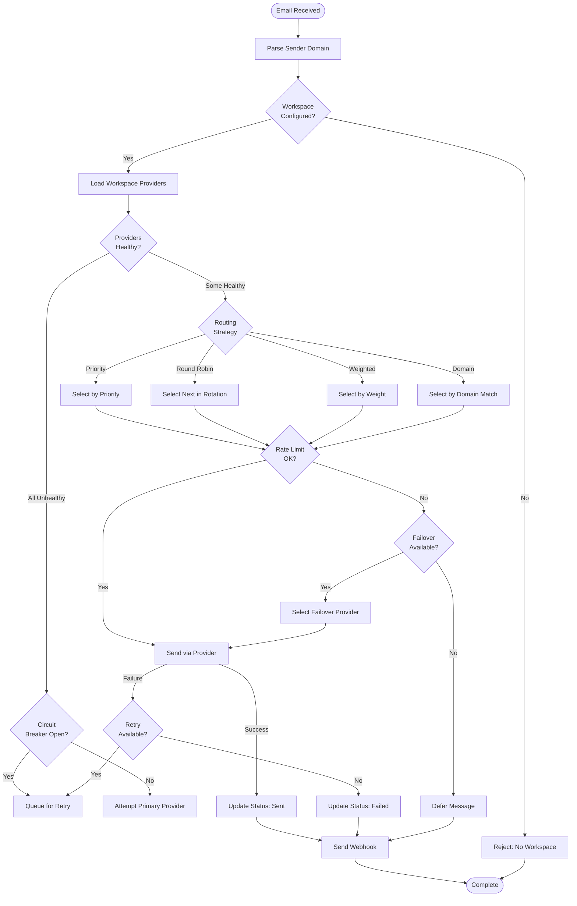

---

## 2. API Documentation

### 2.1 SMTP Interface

**Connection Details:**
- **Host:** 0.0.0.0 (configurable)
- **Port:** 2525 (configurable)
- **Max Message Size:** 10MB (configurable)
- **Timeout:** Read: 10s, Write: 10s

**SMTP Commands Supported:**
- HELO/EHLO
- MAIL FROM
- RCPT TO
- DATA
- QUIT
- RSET
- NOOP

**Authentication:**
Currently no SMTP authentication is required. Messages are routed based on sender domain.

### 2.2 REST API Endpoints

#### Queue Management

**GET /api/messages**
```
Query Parameters:
  - limit: int (default: 50)
  - offset: int (default: 0)
  - status: string (queued|processing|sent|failed|auth_error)

Response:
{
  "messages": [...],
  "total": 100,
  "limit": 50,
  "offset": 0
}
```

**GET /api/messages/{id}**
```
Response:
{
  "id": "uuid",
  "from": "sender@example.com",
  "to": ["recipient@example.com"],
  "subject": "Email Subject",
  "status": "sent",
  "queued_at": "2024-01-01T12:00:00Z",
  "processed_at": "2024-01-01T12:00:30Z"
}
```

**DELETE /api/messages/{id}**
```
Response: 204 No Content
```

#### Statistics & Monitoring

**GET /api/stats**
```
Response:
{
  "queue": {
    "total": 1000,
    "queued": 10,
    "processing": 2,
    "sent": 980,
    "failed": 8
  },
  "rate_limits": {
    "daily_sent": 1500,
    "daily_limit": 2000,
    "remaining": 500
  }
}
```

**GET /api/rate-limit**
```
Response:
{
  "total_sent_today": 1500,
  "workspace_count": 3,
  "workspaces": {
    "workspace1": {
      "sent": 500,
      "limit": 1000,
      "users": {...}
    }
  }
}
```

#### Recipient Management

**GET /api/recipients**
```
Query Parameters:
  - workspace_id: string
  - status: string (ACTIVE|INACTIVE|BOUNCED|UNSUBSCRIBED)
  - limit: int
  - offset: int

Response:
{
  "recipients": [...],
  "total": 5000,
  "pagination": {...}
}
```

**GET /api/recipients/{email}**
```
Response:
{
  "email": "user@example.com",
  "workspace_id": "workspace1",
  "status": "ACTIVE",
  "bounce_count": 0,
  "metadata": {...}
}
```

**PUT /api/recipients/{email}/status**
```
Request:
{
  "status": "UNSUBSCRIBED",
  "reason": "User request"
}

Response: 200 OK
```

### 2.3 Webhook Specifications

#### Mandrill-Compatible Webhooks

**Event Types:**
- `send` - Email successfully sent
- `hard_bounce` - Permanent failure
- `soft_bounce` - Temporary failure
- `deferral` - Message deferred
- `reject` - Message rejected
- `open` - Email opened
- `click` - Link clicked

**Webhook Payload Format:**
```json
[
  {
    "event": "send",
    "_id": "message-uuid",
    "msg": {
      "_id": "message-uuid",
      "state": "sent",
      "email": "recipient@example.com",
      "subject": "Email Subject",
      "sender": "sender@example.com",
      "metadata": {
        "user_id": "12345",
        "campaign_id": "campaign1"
      }
    },
    "ts": 1634567890,
    "workspace_id": "workspace1"
  }
]
```

#### Engagement Tracking Endpoints

**GET /webhook/pixel**
```
Query Parameters:
  - mid: Message ID
  - rid: Recipient ID

Response: 1x1 transparent pixel
```

**GET /webhook/click**
```
Query Parameters:
  - mid: Message ID
  - rid: Recipient ID
  - url: Target URL (encoded)

Response: 302 Redirect to target URL
```

---

## 3. Operational Runbook

### 3.1 Deployment Procedures

#### Local Development Deployment

```bash
# 1. Clone repository
git clone https://github.com/The-Mednet/smtp-relay.git
cd smtp-relay

# 2. Setup environment
make setup

# 3. Configure credentials
cp .env.example .env
# Edit .env with your configuration

# 4. Initialize database
make db-init

# 5. Build and run
make build
./relay
```

#### Docker Deployment

```bash
# 1. Build Docker image
make docker-build

# 2. Configure environment
cp .env.example .env
# Edit .env

# 3. Start services
make docker-up

# 4. View logs
make docker-logs
```

#### Kubernetes Deployment

```yaml
apiVersion: apps/v1
kind: Deployment
metadata:
  name: smtp-relay
spec:
  replicas: 3
  selector:
    matchLabels:
      app: smtp-relay
  template:
    metadata:
      labels:
        app: smtp-relay
    spec:
      containers:
      - name: smtp-relay
        image: mednet/smtp-relay:latest
        ports:
        - containerPort: 2525  # SMTP
        - containerPort: 8080  # Web UI
        env:
        - name: MYSQL_HOST
          value: mysql-service
        - name: MYSQL_DATABASE
          value: relay
        envFrom:
        - secretRef:
            name: smtp-relay-secrets
        volumeMounts:
        - name: credentials
          mountPath: /app/credentials
          readOnly: true
      volumes:
      - name: credentials
        secret:
          secretName: smtp-relay-credentials
```

### 3.2 Monitoring and Alerting

#### Key Metrics to Monitor

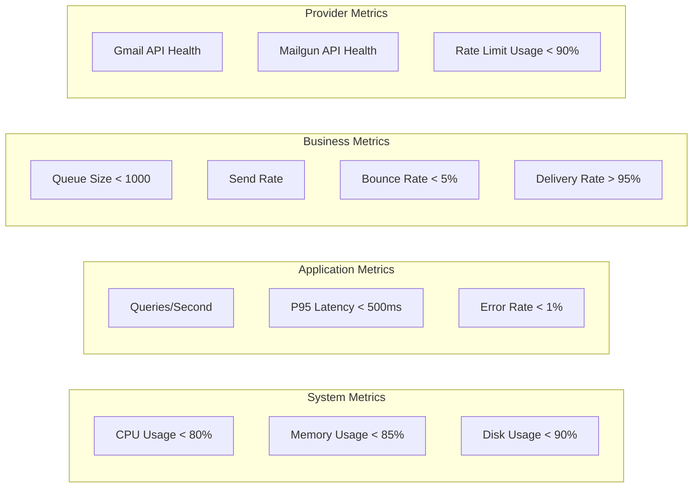

#### New Relic Integration

```go
// Metrics are automatically sent via blaster module
// Key dashboards to create:

1. Email Processing Dashboard
   - Messages processed/minute
   - Average processing time
   - Success/failure rates
   - Queue depth over time

2. Provider Performance Dashboard
   - Provider success rates
   - Provider latency
   - Failover events
   - Circuit breaker trips

3. Rate Limiting Dashboard
   - Daily usage by workspace
   - User-level usage patterns
   - Rate limit violations
   - Deferred messages
```

#### Alert Configuration

| Alert | Condition | Severity | Action |
|-------|-----------|----------|--------|
| Queue Backup | Queue > 5000 messages | Warning | Scale processors |
| Provider Down | Provider health check fails 3x | Critical | Failover to backup |
| Rate Limit Exceeded | Daily limit reached | Warning | Defer non-critical emails |
| Database Connection Lost | MySQL unreachable | Critical | Switch to memory queue |
| High Bounce Rate | Bounce rate > 10% | Warning | Review sender reputation |
| Circuit Breaker Open | Provider circuit open | Warning | Monitor recovery |

### 3.3 Troubleshooting Guide

#### Common Issues and Solutions

**Issue: Emails stuck in queue**
```bash
# Check processor status
curl http://localhost:8080/api/stats

# Check for errors in specific messages
mysql -u root -p relay -e "SELECT id, error, retry_count FROM messages WHERE status='failed';"

# Force reprocess
curl -X POST http://localhost:8080/api/process
```

**Issue: Provider authentication failures**
```bash
# Validate Gmail service account
curl http://localhost:8080/validate

# Check Mailgun API key
curl -G https://api.mailgun.net/v3/domains \
     -u "api:YOUR_API_KEY"

# Review logs
docker logs smtp-relay | grep "auth"
```

**Issue: Rate limiting triggered**
```bash
# Check current usage
curl http://localhost:8080/api/rate-limit

# Identify high-volume senders
mysql -u root -p relay -e "
  SELECT from_email, COUNT(*) as count 
  FROM messages 
  WHERE DATE(queued_at) = CURDATE() 
  GROUP BY from_email 
  ORDER BY count DESC 
  LIMIT 10;"

# Adjust rate limits in workspace.json
```

**Issue: High memory usage**
```bash
# Check queue size
mysql -u root -p relay -e "SELECT COUNT(*) FROM messages WHERE status='queued';"

# Clear old processed messages
mysql -u root -p relay -e "
  DELETE FROM messages 
  WHERE status IN ('sent', 'failed') 
  AND processed_at < DATE_SUB(NOW(), INTERVAL 30 DAY);"

# Restart with memory limits
docker run -m 2g mednet/smtp-relay
```

### 3.4 Performance Tuning

#### MySQL Optimization

```sql
-- Optimize slow queries
EXPLAIN SELECT * FROM messages WHERE status='queued' ORDER BY queued_at LIMIT 10;

-- Add missing indexes
ALTER TABLE messages ADD INDEX idx_workspace_status (workspace_id, status);

-- Tune connection pool (in main.go)
db.SetMaxOpenConns(25)
db.SetMaxIdleConns(10)
db.SetConnMaxLifetime(5 * time.Minute)
```

#### Processing Optimization

```yaml
# Environment variables for tuning
QUEUE_BATCH_SIZE: 20           # Increase for higher throughput
QUEUE_PROCESS_INTERVAL: 10s    # Decrease for lower latency
SMTP_MAX_SIZE: 25485760        # Increase for larger attachments
```

#### Provider Optimization

```json
// workspace.json tuning
{
  "routing": {
    "strategy": "LEAST_LOADED",  // Distribute load
    "health_check": {
      "interval": "30s",          // Reduce API calls
      "timeout": "10s"
    }
  },
  "circuit_breaker": {
    "failure_threshold": 10,     // Allow more failures
    "success_threshold": 5,      // Faster recovery
    "timeout": "60s"
  }
}
```

### 3.5 Backup and Recovery

#### Backup Strategy

```bash
#!/bin/bash
# backup.sh - Run daily via cron

BACKUP_DIR="/backup/smtp-relay"
DATE=$(date +%Y%m%d)

# Backup MySQL database
mysqldump -u root -p relay > $BACKUP_DIR/relay_$DATE.sql

# Backup configuration
tar -czf $BACKUP_DIR/config_$DATE.tar.gz \
  .env \
  workspace.json \
  credentials/

# Backup to S3
aws s3 cp $BACKUP_DIR/ s3://mednet-backups/smtp-relay/ --recursive

# Cleanup old backups (keep 30 days)
find $BACKUP_DIR -name "*.sql" -mtime +30 -delete
find $BACKUP_DIR -name "*.tar.gz" -mtime +30 -delete
```

#### Recovery Procedures

```bash
# 1. Restore database
mysql -u root -p relay < /backup/relay_20240101.sql

# 2. Restore configuration
tar -xzf /backup/config_20240101.tar.gz

# 3. Verify data integrity
mysql -u root -p relay -e "SELECT COUNT(*) FROM messages;"

# 4. Restart services
docker-compose restart

# 5. Verify functionality
curl http://localhost:8080/api/stats
```

#### Disaster Recovery Plan

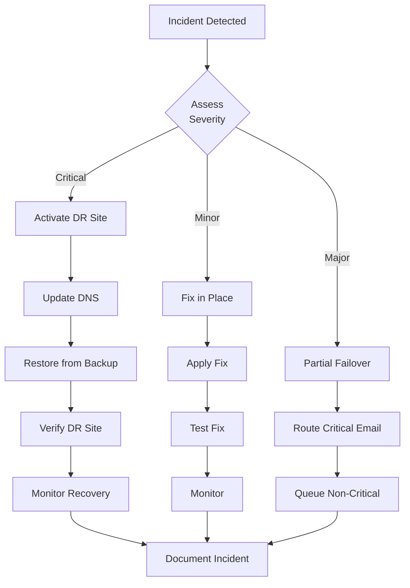

---

## 4. Developer Guide

### 4.1 Development Environment Setup

#### Prerequisites

```bash
# Install Go 1.23+
brew install go

# Install MySQL
brew install mysql
brew services start mysql

# Install development tools
go install github.com/golangci/golangci-lint/cmd/golangci-lint@latest
go install github.com/goreleaser/goreleaser@latest

# Clone repository
git clone https://github.com/The-Mednet/smtp-relay.git
cd smtp-relay

# Install dependencies
make deps
```

#### IDE Configuration (VS Code)

```json
// .vscode/settings.json
{
  "go.lintTool": "golangci-lint",
  "go.lintFlags": ["--fast"],
  "go.formatTool": "goimports",
  "go.testFlags": ["-v", "-race"],
  "go.testTimeout": "30s"
}
```

### 4.2 Code Structure and Patterns

#### Directory Structure

```
smtp-relay/
├── cmd/
│   └── server/          # Application entry point
│       └── main.go      # Main function, initialization
├── internal/            # Private application code
│   ├── config/          # Configuration management
│   ├── gateway/         # Gateway abstraction layer
│   │   ├── interfaces.go
│   │   ├── router/      # Message routing logic
│   │   ├── mailgun/     # Mailgun implementation
│   │   └── reliability/ # Circuit breakers, health checks
│   ├── gmail/           # Gmail provider implementation
│   ├── llm/             # LLM personalization
│   ├── processor/       # Core message processing
│   ├── provider/        # Provider interface and router
│   ├── queue/           # Queue implementations
│   ├── recipient/       # Recipient tracking
│   ├── smtp/            # SMTP server
│   ├── variables/       # Variable replacement
│   ├── webhook/         # Webhook client
│   ├── webui/          # Web UI server
│   └── workspace/       # Workspace management
├── pkg/                 # Public packages
│   └── models/         # Shared data models
├── static/             # Web UI assets
├── tests/              # Integration tests
└── docs/               # Documentation
```

#### Design Patterns Used

**1. Interface-Based Design**
```go
// All providers implement this interface
type Provider interface {
    GetID() string
    GetType() ProviderType
    CanRoute(email string) bool
    Send(ctx context.Context, msg *models.Message) error
    HealthCheck(ctx context.Context) error
    GetMetrics() ProviderMetrics
}
```

**2. Factory Pattern**
```go
// Provider creation based on configuration
func NewProvider(config ProviderConfig) (Provider, error) {
    switch config.Type {
    case "gmail":
        return NewGmailProvider(config)
    case "mailgun":
        return NewMailgunProvider(config)
    default:
        return nil, fmt.Errorf("unknown provider type: %s", config.Type)
    }
}
```

**3. Strategy Pattern**
```go
// Routing strategies
type RoutingStrategy interface {
    SelectProvider(providers []Provider, msg *Message) Provider
}

type PriorityStrategy struct{}
type RoundRobinStrategy struct{}
type WeightedStrategy struct{}
```

**4. Circuit Breaker Pattern**
```go
// Prevent cascading failures
type CircuitBreaker struct {
    failureThreshold int
    successThreshold int
    timeout          time.Duration
    state           State
    failures        int
    successes       int
    lastFailureTime time.Time
}
```

### 4.3 Adding New Providers

#### Step 1: Define Provider Implementation

```go
// internal/provider/sendgrid.go
package provider

import (
    "context"
    "relay/pkg/models"
    "github.com/sendgrid/sendgrid-go"
)

type SendGridProvider struct {
    client     *sendgrid.Client
    apiKey     string
    domain     string
    priority   int
    weight     int
}

func NewSendGridProvider(config ProviderConfig) (*SendGridProvider, error) {
    client := sendgrid.NewSendClient(config.APIKey)
    return &SendGridProvider{
        client:   client,
        apiKey:   config.APIKey,
        domain:   config.Domain,
        priority: config.Priority,
        weight:   config.Weight,
    }, nil
}

func (s *SendGridProvider) GetID() string {
    return "sendgrid_" + s.domain
}

func (s *SendGridProvider) GetType() ProviderType {
    return ProviderTypeSendGrid
}

func (s *SendGridProvider) CanRoute(email string) bool {
    // Check if this provider can handle the sender email
    return strings.HasSuffix(email, "@"+s.domain)
}

func (s *SendGridProvider) Send(ctx context.Context, msg *models.Message) error {
    // Convert message to SendGrid format
    sgMail := mail.NewV3Mail()
    // ... implementation
    
    response, err := s.client.SendWithContext(ctx, sgMail)
    if err != nil {
        return fmt.Errorf("sendgrid send failed: %w", err)
    }
    
    if response.StatusCode >= 400 {
        return fmt.Errorf("sendgrid error: %d - %s", 
            response.StatusCode, response.Body)
    }
    
    return nil
}

func (s *SendGridProvider) HealthCheck(ctx context.Context) error {
    // Implement health check
    // Could be a simple API call to verify credentials
    return nil
}

func (s *SendGridProvider) GetMetrics() ProviderMetrics {
    // Return current metrics
    return ProviderMetrics{
        TotalSent:   s.totalSent,
        TotalFailed: s.totalFailed,
        SuccessRate: s.calculateSuccessRate(),
    }
}
```

#### Step 2: Register Provider Type

```go
// internal/provider/types.go
type ProviderType string

const (
    ProviderTypeGmail    ProviderType = "gmail"
    ProviderTypeMailgun  ProviderType = "mailgun"
    ProviderTypeSendGrid ProviderType = "sendgrid" // Add new type
)
```

#### Step 3: Update Router Factory

```go
// internal/provider/router.go
func (r *Router) InitializeProviders() error {
    for _, workspace := range r.workspaceManager.GetWorkspaces() {
        // ... existing providers
        
        if workspace.SendGrid != nil && workspace.SendGrid.Enabled {
            provider, err := NewSendGridProvider(workspace.SendGrid)
            if err != nil {
                return fmt.Errorf("failed to create SendGrid provider: %w", err)
            }
            r.RegisterProvider(workspace.ID, provider)
        }
    }
    return nil
}
```

#### Step 4: Update Configuration

```go
// internal/config/config.go
type WorkspaceConfig struct {
    ID       string                    `json:"id"`
    Domain   string                    `json:"domain"`
    Gmail    *WorkspaceGmailConfig     `json:"gmail,omitempty"`
    Mailgun  *WorkspaceMailgunConfig   `json:"mailgun,omitempty"`
    SendGrid *WorkspaceSendGridConfig  `json:"sendgrid,omitempty"` // Add new
}

type WorkspaceSendGridConfig struct {
    APIKey   string `json:"api_key"`
    Domain   string `json:"domain"`
    Enabled  bool   `json:"enabled"`
    Priority int    `json:"priority"`
    Weight   int    `json:"weight"`
}
```

### 4.4 Testing Strategies

#### Unit Testing

```go
// internal/provider/gmail_test.go
func TestGmailProvider_Send(t *testing.T) {
    // Setup
    mockClient := &MockGmailClient{}
    provider := &GmailProvider{client: mockClient}
    
    msg := &models.Message{
        From:    "sender@example.com",
        To:      []string{"recipient@example.com"},
        Subject: "Test Email",
        Body:    "Test content",
    }
    
    // Test successful send
    mockClient.On("Send", msg).Return(nil)
    err := provider.Send(context.Background(), msg)
    assert.NoError(t, err)
    mockClient.AssertExpectations(t)
    
    // Test error handling
    mockClient.On("Send", msg).Return(errors.New("API error"))
    err = provider.Send(context.Background(), msg)
    assert.Error(t, err)
}
```

#### Integration Testing

```go
// tests/integration_test.go
func TestEndToEndEmailFlow(t *testing.T) {
    // Start test SMTP server
    server := startTestSMTPServer(t)
    defer server.Stop()
    
    // Send test email
    err := sendTestEmail("test@example.com", "Test Subject", "Test Body")
    require.NoError(t, err)
    
    // Wait for processing
    time.Sleep(5 * time.Second)
    
    // Verify email was sent
    messages := getProcessedMessages(t)
    require.Len(t, messages, 1)
    assert.Equal(t, "sent", messages[0].Status)
    
    // Verify webhook was called
    webhooks := getWebhookCalls(t)
    require.Len(t, webhooks, 1)
    assert.Equal(t, "send", webhooks[0].Event)
}
```

#### Load Testing

```bash
# tests/load_test.sh
#!/bin/bash

# Generate test emails
for i in {1..1000}; do
    swaks --to test@example.com \
          --from sender$i@example.com \
          --server localhost:2525 \
          --header "Subject: Load Test $i" \
          --body "Test message $i" &
    
    # Rate limit to avoid overwhelming
    if [ $((i % 100)) -eq 0 ]; then
        sleep 1
    fi
done

wait

# Check results
curl http://localhost:8080/api/stats | jq .
```

### 4.5 Contributing Guidelines

#### Code Style

```go
// Follow Go idioms and conventions
// Good
func (s *Server) ProcessMessage(ctx context.Context, msg *Message) error {
    // Validate input
    if err := msg.Validate(); err != nil {
        return fmt.Errorf("invalid message: %w", err)
    }
    
    // Process with timeout
    ctx, cancel := context.WithTimeout(ctx, 30*time.Second)
    defer cancel()
    
    // Handle errors explicitly
    if err := s.sender.Send(ctx, msg); err != nil {
        // Log error with context
        log.Printf("Failed to send message %s: %v", msg.ID, err)
        return err
    }
    
    return nil
}

// Bad
func process(m *Message) {
    s.Send(m) // Ignoring errors
}
```

#### Pull Request Process

1. **Branch Naming**
   - `feature/` - New features
   - `fix/` - Bug fixes
   - `docs/` - Documentation
   - `refactor/` - Code refactoring

2. **Commit Messages**
   ```
   type(scope): description
   
   - feat(provider): add SendGrid provider support
   - fix(queue): resolve memory leak in batch processing
   - docs(api): update webhook documentation
   - refactor(router): simplify routing logic
   ```

3. **PR Checklist**
   - [ ] Tests pass (`make test`)
   - [ ] Linting passes (`make lint`)
   - [ ] Documentation updated
   - [ ] Backward compatible
   - [ ] Performance impact considered
   - [ ] Security implications reviewed

#### Review Process

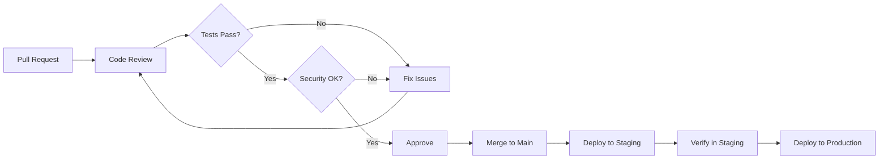

---

## 5. Security & Compliance

### 5.1 Security Controls

#### Authentication & Authorization

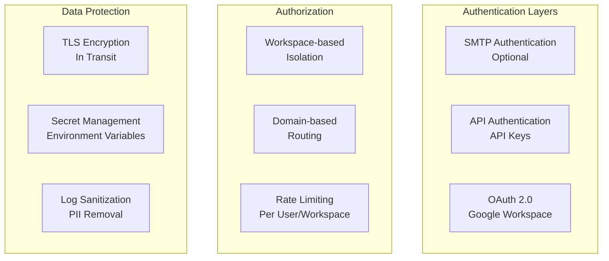

#### Security Best Practices

1. **Input Validation**
```go
func validateEmail(email string) error {
    // RFC 5321 compliant validation
    if len(email) > 320 {
        return errors.New("email too long")
    }
    
    // Check for injection attempts
    if strings.ContainsAny(email, "\r\n") {
        return errors.New("invalid characters in email")
    }
    
    // Validate format
    if !emailRegex.MatchString(email) {
        return errors.New("invalid email format")
    }
    
    return nil
}
```

2. **SQL Injection Prevention**
```go
// Always use parameterized queries
query := `
    SELECT * FROM messages 
    WHERE workspace_id = ? AND status = ?
    LIMIT ?
`
rows, err := db.Query(query, workspaceID, status, limit)
```

3. **Secret Management**
```bash
# Use environment variables or secret managers
export GMAIL_SERVICE_ACCOUNT_KEY=$(aws secretsmanager get-secret-value \
    --secret-id smtp-relay/gmail-key \
    --query SecretString --output text)

# Never commit secrets
echo "credentials/" >> .gitignore
echo ".env" >> .gitignore
```

### 5.2 HIPAA Compliance

#### Technical Safeguards

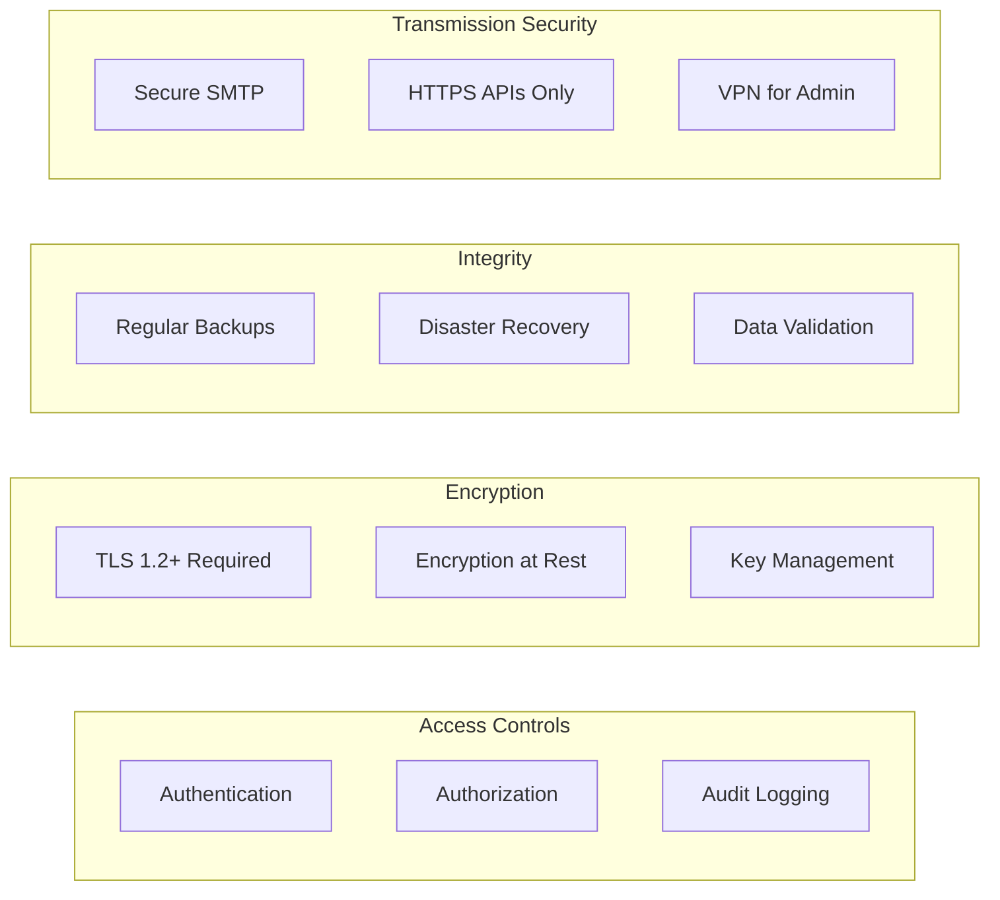

#### PHI Handling Guidelines

1. **Minimum Necessary Rule**
   - Only process PHI that is necessary
   - Implement field-level access controls
   - Automatic PHI detection and masking

2. **Audit Trail Requirements**
```sql
CREATE TABLE audit_log (
    id BIGINT PRIMARY KEY AUTO_INCREMENT,
    user_id VARCHAR(255),
    action VARCHAR(50),
    resource_type VARCHAR(50),
    resource_id VARCHAR(255),
    ip_address VARCHAR(45),
    user_agent TEXT,
    request_data JSON,
    response_status INT,
    created_at TIMESTAMP DEFAULT CURRENT_TIMESTAMP,
    INDEX idx_user_action (user_id, action, created_at),
    INDEX idx_resource (resource_type, resource_id)
);
```

3. **Data Retention Policies**
```go
// Automatic PHI cleanup after retention period
func cleanupPHI() error {
    retentionDays := 2555 // 7 years for HIPAA
    
    query := `
        DELETE FROM messages 
        WHERE processed_at < DATE_SUB(NOW(), INTERVAL ? DAY)
        AND contains_phi = true
    `
    
    _, err := db.Exec(query, retentionDays)
    return err
}
```

### 5.3 Audit Logging

#### Comprehensive Audit Events

```go
type AuditEvent struct {
    Timestamp   time.Time `json:"timestamp"`
    EventType   string    `json:"event_type"`
    UserID      string    `json:"user_id"`
    WorkspaceID string    `json:"workspace_id"`
    Action      string    `json:"action"`
    Resource    string    `json:"resource"`
    Result      string    `json:"result"`
    IPAddress   string    `json:"ip_address"`
    UserAgent   string    `json:"user_agent"`
    Details     map[string]interface{} `json:"details"`
}

func LogAuditEvent(event AuditEvent) {
    // Sanitize PII
    event = sanitizePII(event)
    
    // Log to multiple destinations
    logToDatabase(event)
    logToSIEM(event)
    logToFile(event)
}
```

#### Events to Audit

| Event Category | Specific Events | Data Captured |
|----------------|-----------------|---------------|
| Authentication | Login, Logout, Failed Auth | User, IP, Time |
| Authorization | Access Denied, Permission Change | User, Resource, Action |
| Data Access | Email Sent, Queue Read, Recipient View | User, Data ID, Action |
| Configuration | Settings Changed, Provider Added | User, Setting, Old/New Value |
| Security | Suspicious Activity, Rate Limit | IP, Pattern, Action Taken |
| System | Service Start/Stop, Error | Component, Status, Error |

### 5.4 Data Retention Policies

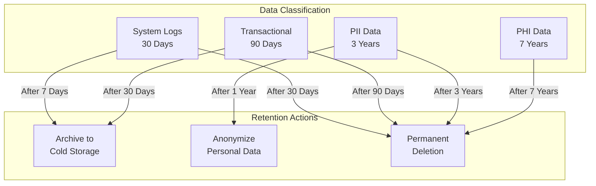

### 5.5 Incident Response Procedures

#### Incident Response Plan

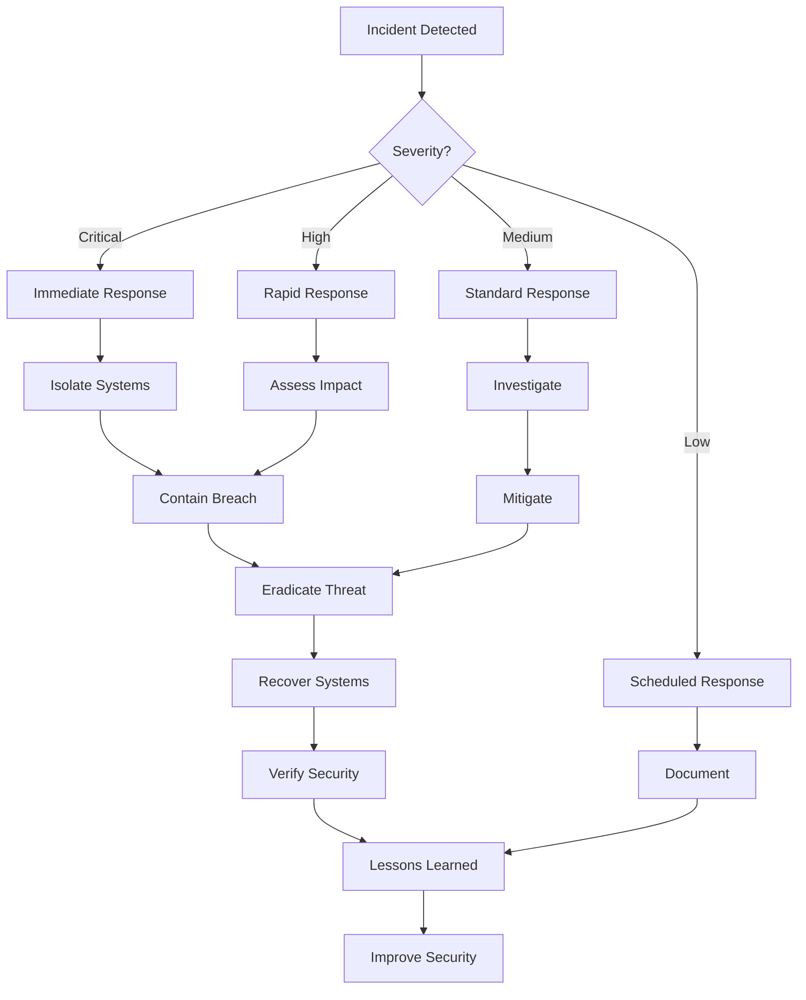

#### Security Incident Types

1. **Data Breach Response**
```bash
#!/bin/bash
# breach_response.sh

# 1. Isolate affected systems
docker stop smtp-relay
iptables -A INPUT -s $AFFECTED_IP -j DROP

# 2. Preserve evidence
mysqldump relay > /secure/evidence/relay_$(date +%Y%m%d_%H%M%S).sql
tar -czf /secure/evidence/logs_$(date +%Y%m%d_%H%M%S).tar.gz /var/log/

# 3. Notify stakeholders
./notify_breach.sh --severity CRITICAL --affected-data PHI

# 4. Begin investigation
./analyze_breach.sh --start-time "$INCIDENT_TIME" --ip "$SOURCE_IP"
```

2. **DDoS Mitigation**
```nginx
# Rate limiting configuration
limit_req_zone $binary_remote_addr zone=smtp:10m rate=10r/s;
limit_req_zone $binary_remote_addr zone=api:10m rate=100r/s;

server {
    location /api/ {
        limit_req zone=api burst=20 nodelay;
        # Additional DDoS protection
        if ($http_user_agent ~* "bot|crawler|spider") {
            return 403;
        }
    }
}
```

---

## 6. Configuration Reference

### 6.1 Environment Variables

| Variable | Type | Default | Description |
|----------|------|---------|-------------|
| **SMTP Configuration** |
| SMTP_HOST | string | 0.0.0.0 | SMTP server bind address |
| SMTP_PORT | int | 2525 | SMTP server port |
| SMTP_MAX_SIZE | int | 10485760 | Maximum message size (bytes) |
| SMTP_READ_TIMEOUT | duration | 10s | SMTP read timeout |
| SMTP_WRITE_TIMEOUT | duration | 10s | SMTP write timeout |
| **MySQL Configuration** |
| MYSQL_HOST | string | localhost | MySQL server host |
| MYSQL_PORT | int | 3306 | MySQL server port |
| MYSQL_USER | string | root | MySQL username |
| MYSQL_PASSWORD | string | - | MySQL password |
| MYSQL_DATABASE | string | relay | MySQL database name |
| **Queue Configuration** |
| QUEUE_PROCESS_INTERVAL | duration | 30s | Processing interval |
| QUEUE_BATCH_SIZE | int | 10 | Batch size for processing |
| QUEUE_MAX_RETRIES | int | 3 | Maximum retry attempts |
| QUEUE_DAILY_RATE_LIMIT | int | 2000 | Daily rate limit |
| **Provider Configuration** |
| GATEWAY_CONFIG_FILE | string | - | Gateway configuration file |
| WORKSPACE_CONFIG_FILE | string | workspace.json | Workspace configuration |
| **LLM Configuration** |
| LLM_ENABLED | bool | false | Enable LLM personalization |
| LLM_PROVIDER | string | openai | LLM provider (openai/azure/groq) |
| LLM_API_KEY | string | - | LLM API key |
| LLM_MODEL | string | gpt-3.5-turbo | LLM model to use |
| LLM_TIMEOUT | duration | 30s | LLM request timeout |
| **Webhook Configuration** |
| MANDRILL_WEBHOOK_URL | string | - | Mandrill webhook endpoint |
| WEBHOOK_TIMEOUT | duration | 30s | Webhook request timeout |
| WEBHOOK_MAX_RETRIES | int | 3 | Maximum webhook retries |
| **Server Configuration** |
| WEB_UI_PORT | int | 8080 | Web UI port |
| METRICS_PORT | int | 9090 | Metrics port |
| LOG_LEVEL | string | info | Log level (debug/info/warn/error) |

### 6.2 Workspace Configuration

```json
{
  "id": "workspace1",
  "domain": "example.com",
  "display_name": "Example Workspace",
  "rate_limits": {
    "workspace_daily": 5000,
    "per_user_daily": 500,
    "custom_user_limits": {
      "high-volume@example.com": 2000,
      "newsletter@example.com": 10000
    }
  },
  "gmail": {
    "service_account_file": "credentials/example-sa.json",
    "enabled": true,
    "default_sender": "noreply@example.com",
    "require_valid_sender": true
  },
  "mailgun": {
    "api_key": "key-abc123",
    "domain": "mg.example.com",
    "base_url": "https://api.mailgun.net",
    "region": "US",
    "enabled": false,
    "tracking": {
      "opens": true,
      "clicks": true,
      "unsubscribe": true
    },
    "default_tags": ["transactional", "production"],
    "header_rewrite": {
      "enabled": true,
      "rules": [
        {
          "header_name": "List-Unsubscribe",
          "new_value": "<https://example.com/unsubscribe>"
        }
      ]
    }
  }
}
```

### 6.3 Gateway Configuration

```json
{
  "gateways": [
    {
      "id": "primary_gmail",
      "type": "gmail",
      "enabled": true,
      "priority": 1,
      "weight": 70,
      "provider_config": {
        "service_account_file": "credentials/gmail-sa.json",
        "workspace_domain": "example.com",
        "impersonate_users": true
      },
      "rate_limits": {
        "per_second": 10,
        "per_minute": 250,
        "per_hour": 1000,
        "daily": 10000
      },
      "circuit_breaker": {
        "enabled": true,
        "failure_threshold": 5,
        "success_threshold": 2,
        "timeout": "30s",
        "max_requests": 100
      },
      "health_check": {
        "enabled": true,
        "interval": "60s",
        "timeout": "10s",
        "endpoint": "https://www.googleapis.com/gmail/v1/users/me/profile"
      },
      "routing": {
        "can_route": ["@example.com", "@sub.example.com"],
        "exclude_patterns": ["noreply@*", "system@*"],
        "failover_to": ["backup_mailgun"]
      }
    },
    {
      "id": "backup_mailgun",
      "type": "mailgun",
      "enabled": true,
      "priority": 2,
      "weight": 30,
      "provider_config": {
        "api_key": "key-xyz789",
        "domain": "mg.example.com",
        "region": "US"
      },
      "rate_limits": {
        "per_second": 100,
        "daily": 100000
      },
      "routing": {
        "can_route": ["*"],
        "failover_to": []
      }
    }
  ],
  "global_defaults": {
    "rate_limits": {
      "workspace_daily": 2000,
      "per_user_daily": 200,
      "per_hour": 50,
      "burst_limit": 10
    },
    "circuit_breaker": {
      "enabled": true,
      "failure_threshold": 10,
      "success_threshold": 5,
      "timeout": "60s"
    },
    "health_check": {
      "enabled": true,
      "interval": "30s",
      "timeout": "10s"
    },
    "routing_strategy": "PRIORITY"
  },
  "routing": {
    "strategy": "PRIORITY",
    "failover_enabled": true,
    "load_balancing_enabled": false,
    "health_check_required": true,
    "circuit_breaker_required": true
  }
}
```

### 6.4 Rate Limiting Configuration

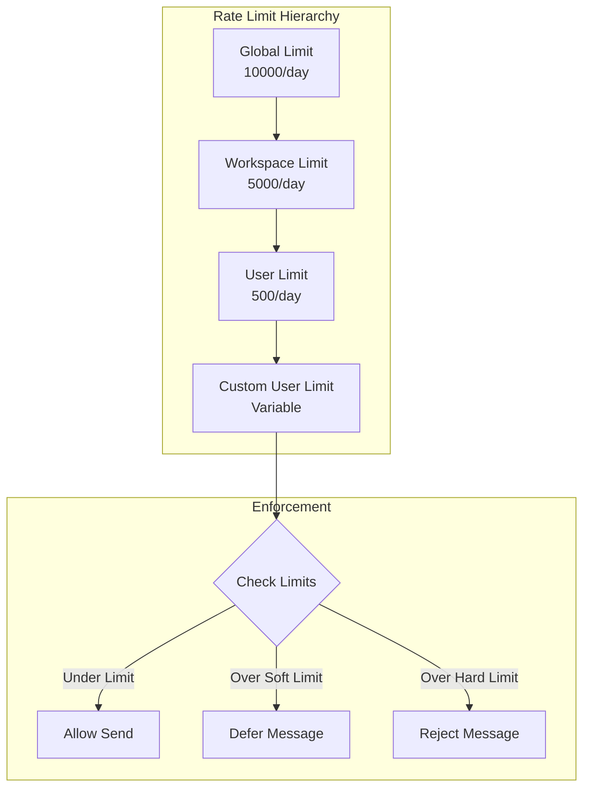

### 6.5 Variable Replacement

The system supports dynamic variable replacement in email content:

| Variable | Description | Example Value |
|----------|-------------|---------------|
| `{{FIRST_NAME}}` | Recipient's first name | John |
| `{{LAST_NAME}}` | Recipient's last name | Doe |
| `{{EMAIL}}` | Recipient's email | john.doe@example.com |
| `{{DATE}}` | Current date | 2024-01-15 |
| `{{TIME}}` | Current time | 14:30:00 |
| `{{WORKSPACE}}` | Workspace name | Example Corp |
| `{{CAMPAIGN_ID}}` | Campaign identifier | CAMP-12345 |
| `{{USER_ID}}` | User identifier | USER-67890 |
| `{{UNSUBSCRIBE_URL}}` | Unsubscribe link | https://example.com/unsub/... |
| `{{TRACKING_PIXEL}}` | Open tracking pixel |  |
| `<<TRENDING_QUESTION>>` | Trending medical question | Latest trending topic |

**Custom Variable Definition:**
```json
{
  "custom_variables": {
    "COMPANY_NAME": "Mednet, Inc.",
    "SUPPORT_EMAIL": "support@mednet.com",
    "CURRENT_YEAR": "2024"
  }
}
```

---

## Appendices

### A. Troubleshooting Checklist

- [ ] Check service health: `curl http://localhost:8080/api/stats`
- [ ] Verify MySQL connectivity: `mysql -u root -p relay -e "SELECT 1"`
- [ ] Check provider authentication: `curl http://localhost:8080/validate`
- [ ] Review error logs: `docker logs smtp-relay | grep ERROR`
- [ ] Verify rate limits: `curl http://localhost:8080/api/rate-limit`
- [ ] Check queue depth: `SELECT COUNT(*) FROM messages WHERE status='queued'`
- [ ] Test SMTP connectivity: `telnet localhost 2525`
- [ ] Verify webhook endpoint: `curl -X POST http://localhost:8080/webhook/test`

### B. Performance Benchmarks

| Metric | Target | Current | Notes |
|--------|--------|---------|-------|
| SMTP Processing | < 100ms | 85ms | Per message |
| Queue Processing | 1000 msg/min | 850 msg/min | With personalization |
| API Response Time | < 200ms | 150ms | P95 latency |
| Database Queries | < 50ms | 35ms | Average query time |
| Memory Usage | < 2GB | 1.5GB | Under normal load |
| CPU Usage | < 70% | 55% | 4 cores |

### C. Emergency Contacts

| Role | Contact | Escalation |
|------|---------|------------|
| On-Call Engineer | PagerDuty | Immediate |
| Database Admin | DBA Team | 15 minutes |
| Security Team | security@mednet.com | For breaches |
| Provider Support | See vendor docs | Business hours |

### D. Related Documentation

- [Gmail API Documentation](https://developers.google.com/gmail/api)
- [Mailgun API Reference](https://documentation.mailgun.com/en/latest/)
- [MySQL Performance Tuning](https://dev.mysql.com/doc/refman/8.0/en/optimization.html)
- [Go Best Practices](https://golang.org/doc/effective_go.html)
- [HIPAA Compliance Guide](https://www.hhs.gov/hipaa/for-professionals/security/index.html)

---

*Document Version: 1.0.0*  
*Last Updated: 2024-01-15*  
*Next Review: 2024-04-15*  
*Owner: Mednet Engineering Team*